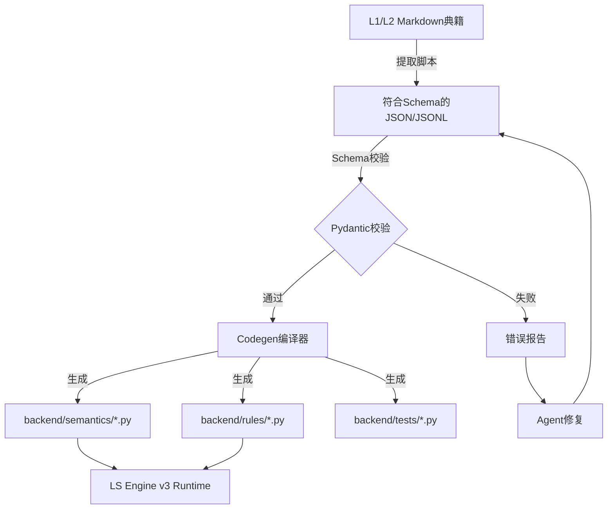
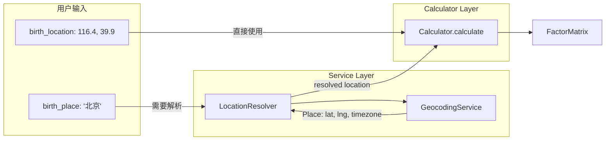

# LucidSelf 引擎架构设计 v3.0

> **全新Python原生架构 - 彻底告别JSON/DSL时代**

## 一、架构总览

### 核心理念
- **Python原生**：所有逻辑、语义、规则全部用Python代码表达
- **可追溯证据链**：每个结论都能追溯到典籍原文和计算过程
- **多体系交叉验证**：通过不同占卜体系的相互印证提高可信度
- **个性化长期记忆**：系统能记住用户，提供连续性的生命叙事
- **从源头开始**：典籍精校直接生成Python代码，无中间格式

### 技术选型
```yaml
语言: Python 3.12+
框架: FastAPI + Pydantic
存储: PostgreSQL (主库) + Redis (缓存) + Vector DB (语义搜索)
模型: 多层级LLM智能路由
部署: Docker + Kubernetes
```

### 架构原则
1. **Code is Documentation**：Python代码即文档，类型注解即Schema
2. **关注点分离**：计算、语义、规则、融合、应用各司其职
3. **渐进式增强**：单体系可用→双体系验证→多体系融合
4. **成本可控**：分层使用不同规模的模型，优化成本效益比
5. **Zero JSON Philosophy**：内部逻辑零JSON，仅在API边界序列化
6. **TOON at LLM Boundary**：内部用Pydantic（类型安全），LLM边界用TOON（Token压缩）

## 二、代码生成流程（关键环节）

### 2.1 从内容到代码的编译流程



### 2.2 代码生成器设计

```python
# scripts/codegen/rule_generator.py
from typing import Dict, List
from pathlib import Path
import black
import ast

class RuleCodeGenerator:
    """
    将JSON规则定义编译为Python代码
    Agent产出JSON -> 编译器生成Python
    """
    
    def __init__(self, schema_validator: SchemaValidator):
        self.validator = schema_validator
        self.output_dir = Path("backend/generated/rules")
        
    def compile_rule(self, rule_json: Dict) -> str:
        """将JSON规则编译为Python函数"""
        
        # 1. 验证Schema
        rule_def = ConfigRuleDefinition(**rule_json)
        self.validator.validate(rule_def)
        
        # 2. 生成Python代码
        if rule_def.is_complex_logic:
            # 复杂逻辑：生成框架，标记需人工实现
            return self._generate_complex_stub(rule_def)
        else:
            # 简单逻辑：完全自动生成
            return self._generate_simple_rule(rule_def)
    
    def _generate_simple_rule(self, rule: ConfigRuleDefinition) -> str:
        """生成简单规则的Python代码"""
        
        code = f'''
@register_rule(
    rule_id="{rule.rule_id}",
    category="{rule.category}",
    exclusive_group="{rule.exclusive_group or ''}",
    priority={rule.priority}
)
def {rule.rule_id}_evaluate(context: RuleContext) -> RuntimeRuleResult:
    """
    自动生成的规则：{rule.human_label}
    源文件：{rule.metadata.source_book}
    """
    
    # 检查所需因子
    factors = context.get_factors({rule.required_factors})
    
    # 执行条件判断
    condition_met = {self._compile_condition(rule.condition)}
    
    if condition_met:
        return RuntimeRuleResult(
            matched=True,
            dimension="{rule.result.dimension}",
            level="{rule.result.level}",
            description=f"{rule.result.conclusion_template_zh}",
            evidence=factors,
            weight={rule.result.weight}
        )
    
    return RuntimeRuleResult(matched=False)
'''
        
        # 格式化代码
        return black.format_str(code, mode=black.Mode())
    
    def _compile_condition(self, condition: Union[Dict, str]) -> str:
        """将JSON条件编译为Python表达式"""
        if isinstance(condition, dict):
            op = condition["operator"]
            if op == "AND":
                return f"({' and '.join(self._compile_condition(c) for c in condition['conditions'])})"
            elif op == "OR":
                return f"({' or '.join(self._compile_condition(c) for c in condition['conditions'])})"
            elif op == "NOT":
                return f"(not {self._compile_condition(condition['condition'])})"
            else:  # 比较操作
                factor = f"factors['{condition['factor_id']}']"
                value = repr(condition['value'])
                return f"({factor} {op.lower()} {value})"
        else:
            # 直接的Python表达式（高级用法）
            return str(condition)
```

### 2.3 为什么需要代码生成器？

1. **安全性**：Agent不直接修改.py文件，只产出数据
2. **可审计**：JSON是"源码"，Python是"编译产物"
3. **性能**：运行时执行编译好的Python代码，无需解析
4. **版本管理**：JSON数据和生成的代码都纳入版本控制
5. **渐进增强**：简单规则自动生成，复杂规则人工优化

### 2.3 Zero JSON Philosophy（合法位置声明）

**核心原则**：运行时内部零JSON，JSON只在三个合法位置出现。

```python
# backend/core/policies/json_usage.py

class JSONUsagePolicy:
    """
    Zero JSON Philosophy的明确解释：
    运行时内部零JSON，但在三个合法位置允许JSON
    """
    
    ALLOWED_POSITIONS = {
        # 1. 离线/人机协作中转格式
        "offline_transfer": {
            "description": "典籍精校团队 → 规则工程师 → Codegen的交付物",
            "files": [
                "factors.registry.json",
                "rules.definition.jsonl",
                "narrative.profiles.json"
            ],
            "constraint": "必须通过Pydantic Schema校验后编译为Python"
        },
        
        # 2. 版本归档/回滚
        "version_archive": {
            "description": "规则/因子的JSONL是'配置源码'，Python是'编译产物'",
            "usage": "运行时只读Python模块，不读JSON",
            "purpose": "支持版本对比、回滚、审计"
        },
        
        # 3. 对外API/工具I/O
        "external_boundary": {
            "description": "系统边界的序列化格式",
            "scenarios": [
                "FastAPI HTTP请求/响应",
                "L3/L4 Agent的输入输出",
                "第三方工具集成"
            ]
        }
    }
    
    FORBIDDEN = "运行时内部(Engine Layer1-4)一律禁止读写JSON文件"
```

**目录结构**：

```
data/                          # 配置源码（版本控制）
├── factors/
│   ├── bazi/factors.jsonl    # ConfigFactor
│   └── registry.json
├── rules/
│   ├── bazi/career.jsonl     # ConfigRuleDefinition
│   └── registry.json
└── engines/registry.json      # EngineDescriptor

backend/generated/             # 编译产物（.gitignore）
├── factors/bazi_factors_v1_0_0.py
├── rules/bazi_career_v1_0_0.py
└── .codegen_manifest.json
```

## 三、配置态vs运行态契约（核心分离原则）

**架构红线**：严格区分配置源码与运行时对象，禁止混用。

### 3.1 命名规范表

| 前缀 | 用途 | 示例 | 位置 |
|------|------|------|------|
| `Config...` | 配置态（JSONL/Markdown输出） | `ConfigRuleDefinition`, `ConfigFactor` | JSON文件、Codegen输入 |
| `Runtime...` | 运行态（Engine内存对象） | `RuntimeRuleResult`, `FactorValue` | Layer1-4执行时 |
| `...Descriptor` | 元信息登记 | `EngineDescriptor`, `FactorDescriptor` | 注册表 |
| `...Record` | 日志/观测 | `LLMUsageRecord`, `FusionAuditRecord` | 观测层 |

### 3.2 配置态模型（JSON Schema）

```python
# backend/core/contracts/config_models.py
from pydantic import BaseModel, Field
from typing import Literal, Optional, Union
from datetime import datetime

class ConfigRuleResult(BaseModel):
    """配置态规则结果（规则定义时的静态配置）"""
    dimension: str = Field(..., description="维度：事业/健康/婚姻等")
    level: Literal["大吉", "吉", "中等", "凶", "大凶"]
    conclusion_template_zh: str = Field(..., description="中文结论模板，支持{factor_id}变量插值")
    weight: float = Field(default=1.0, ge=0.0, le=10.0)
    confidence: float = Field(default=0.8, ge=0.0, le=1.0)
    tags: list[str] = Field(default_factory=list)
    evidence_factors: list[str] = Field(default_factory=list)

class ConfigRuleDefinition(BaseModel):
    """规则定义（配置态）- Agent/精校团队产出"""
    rule_id: str = Field(..., regex="^[a-z][a-z0-9_]*$")
    human_label: str
    category: str
    
    # 触发条件
    condition: Union[RuleCondition, LogicalExpression]
    required_factors: list[str]
    
    # 配置态结果
    result: ConfigRuleResult
    
    # 版本与归属
    version: str = Field(..., regex="^\\d+\\.\\d+\\.\\d+$")
    status: Literal["active", "experimental", "deprecated"] = "active"
    engine_id: str = Field(..., description="所属引擎ID")
    
    # 元信息
    priority: int = Field(default=500, ge=0, le=999)
    exclusive_group: Optional[str] = None
    is_complex_logic: bool = False
    python_handler_ref: Optional[str] = None
    metadata: SourceMetadata
```

### 3.3 运行态模型（Engine Runtime）

```python
# backend/core/contracts/runtime_models.py

class RuntimeRuleResult(BaseModel):
    """规则执行结果（运行态）- Rule Engine实际返回"""
    rule_id: str
    matched: bool
    
    # 仅匹配时填充
    dimension: Optional[str] = None
    level: Optional[str] = None
    description: Optional[str] = None  # 模板渲染后的成品文案
    
    # 运行时元数据
    confidence: float
    weight: float
    tags: list[str]
    evidence_factors: list[str]
    semantic_refs: list[str] = []  # 关联的语义条目ID
    
    # 溯源信息
    source_book: Optional[str] = None
    l1_anchor: Optional[str] = None
    execution_time_ms: float

class FactorValue(BaseModel):
    """运行态因子值 - Calculator层计算产出"""
    factor_id: str
    value: Any
    confidence: float = Field(ge=0.0, le=1.0)
    source: str = Field(..., description="计算源：calculator/semantic/manual")

class FactorMatrix(BaseModel):
    """运行态因子矩阵 - 完整的因子集合"""
    factors: dict[str, FactorValue]
    timestamp: datetime = Field(default_factory=datetime.now)
    engine_id: str
```

### 3.4 Codegen映射规则（严格约束）

```python
# backend/codegen/mapping_rules.py

CODEGEN_MAPPING = """
严格映射规则（禁止跨用）：

1. ConfigRuleDefinition → Codegen → Python函数 → 返回RuntimeRuleResult
2. ConfigRuleResult.conclusion_template_zh → TemplateEngine → RuntimeRuleResult.description
3. ConfigFactor → Calculator → FactorValue → FactorMatrix
4. 所有Fusion/TOON/evidence_chain只接受Runtime*类型
5. 配置态仅存在于JSON/JSONL文件与Codegen输入阶段
6. 运行态仅存在于Engine Layer1-5内存中
7. 类型检查：Pydantic严格校验，禁止Config对象进入Runtime流程
"""

# 禁止行为
FORBIDDEN_PATTERNS = [
    "直接读取ConfigRuleDefinition进行规则执行",
    "将RuntimeRuleResult序列化回JSON作为配置源",
    "在Fusion中混用Config和Runtime类型",
    "跳过Codegen直接消费JSON配置"
]
```

### 3.5 三层体系对齐矩阵

| Content层级 | Engine层级 | Memory层级 | 说明 |
|------------|-----------|-----------|------|
| L1 (原始典籍+精校) | - | - | Markdown格式，人类可读；包含双语规范化释义、核心要点、详细解说，以及叙事素材narrative_snippets（每条含trigger+role+溯源锚点） |
| L2 (语义提取) | Layer 2 (Semantic) | - | 语义知识库 |
| L3 (规则定义) | Layer 3 (Rule) | - | ConfigRuleDefinition |
| L4 (叙事配置) | Layer 5 (Application) | - | NarrativeConfig |
| - | Layer 1 (Calculator) | - | 纯计算，无Content输入 |
| - | Layer 4 (Fusion) | SESSION | 融合多引擎结果 |
| - | - | EVENT | 原始用户事件 |
| - | - | INSIGHT | 结构化洞察 |
| - | - | PROFILE | 长期用户画像 |

## 四、五层引擎架构设计

### Layer 1: 基础计算层（Domain Calculators）

纯粹的领域计算，不涉及任何解释或语义。

#### 4.1.1 Calculator 总览

Layer 1 包含 6 个核心 Calculator，分为两类：

| Calculator | 需要位置 | 需要时间 | 输入特点 | 状态 |
|------------|---------|---------|---------|------|
| **BaziCalculator** | ✅ | ✅ | 出生日期时间 + 位置 | ✅ 已实现 |
| **ZiweiCalculator** | ✅ | ✅ | 出生日期时间 + 位置 | ✅ 已实现 |
| **AstroCalculator** | ✅ | ✅ | 出生日期时间 + 位置 | ✅ 已实现 |
| **YijingCalculator** | 可选 | 可选 | 起卦方法 + 可选位置 | ✅ 已实现 |
| **TarotInterpreter** | ❌ | ❌ | 牌阵配置 | ✅ 已实现 |
| **DreamExtractor** | ❌ | ❌ | 梦境文本 | ✅ 已实现 |

**性能目标**：

| Calculator | 目标延迟 (P95) | 准确率目标 |
|------------|---------------|-----------|
| BaziCalculator | < 10ms | 四柱 100%, 十神 > 99% |
| ZiweiCalculator | < 50ms | 排盘 > 99%, 四化 100% |
| AstroCalculator | < 30ms | 星历精度 < 1弧分 |
| TarotInterpreter | < 5ms | 78张牌义覆盖 100% |
| DreamExtractor | < 20ms | 符号匹配召回率 > 90% |
| YijingCalculator | < 10ms | 64卦计算正确率 100% |

#### 4.1.2 Geocoding 集成模式

需要位置信息的 Calculator（BaZi、ZiWei、Astro、Yijing-时间起卦）都支持两种位置输入方式：

1. **birth_location**: 直接提供 (经度, 纬度) 坐标
2. **birth_place**: 提供城市名，自动通过 GeocodingService 解析

**设计原则**：
- Calculator 核心计算保持**同步**，便于测试和复用
- Geocoding 是 I/O 操作，在 **Service 层异步处理**
- 优先级：`birth_location > birth_place`（向后兼容）



**LocationResolver 实现**：

```python
# backend/core/geocoding/resolver.py
class LocationResolver:
    """
    位置解析器 - 在 Calculator 外部处理 Geocoding。
    
    设计理由：
    1. Calculator 保持纯同步计算，便于测试和复用
    2. Geocoding 是 I/O 操作，应在调用层处理
    3. 支持批量解析和缓存优化
    """
    
    async def resolve(
        self,
        birth_place: Optional[str],
        birth_location: Optional[Tuple[float, float]],
        timezone: Optional[str] = None
    ) -> Tuple[Tuple[float, float], str]:
        """
        解析位置信息。
        优先级：birth_location > birth_place
        
        Returns:
            Tuple of ((longitude, latitude), timezone)
        """
        # 如果已有坐标，直接使用
        if birth_location is not None:
            tz = timezone or "Asia/Shanghai"
            return birth_location, tz
        
        # 通过 Geocoding 解析
        if birth_place is not None and birth_place.strip():
            place = await self.geocoding_service.resolve_place(
                ResolvePlaceInput(input_text=birth_place)
            )
            tz = timezone or place.timezone
            return (place.lng, place.lat), tz
        
        raise InvalidInputError("Either birth_place or birth_location must be provided")
```

#### 4.1.3 BaziCalculator（八字计算器）

计算四柱、藏干、十神、大运。需要精确的出生时间和位置来计算真太阳时。

```python
# backend/calculators/bazi/models.py
class BaziInput(BaseModel):
    """八字计算输入模型 - 支持 Geocoding"""
    birth_datetime: datetime
    birth_place: Optional[str] = None      # 出生地名，如 '北京'
    birth_location: Optional[Tuple[float, float]] = None  # (经度, 纬度)
    gender: Literal["male", "female"]
    timezone: Optional[str] = None
    calendar_type: str = "gregorian"
    
    @model_validator(mode='after')
    def validate_location(self):
        if not self.birth_place and not self.birth_location:
            raise ValueError("Either birth_place or birth_location must be provided")
        return self

class BaziFactors(BaseModel):
    """八字因子输出"""
    four_pillars: FourPillars
    hidden_stems: List[HiddenStem]
    ten_gods: List[TenGod]
    day_master: DayMaster
    dayun: List[DayunPeriod]
    calculation_time_ms: float
    
    def to_factor_matrix(self) -> FactorMatrix:
        """转换为统一的 FactorMatrix 格式"""
        factors = {}
        # 四柱因子
        for pillar_name, pillar in self.four_pillars.items():
            factors[f"bazi_{pillar_name}_stem"] = FactorValue(
                factor_id=f"bazi_{pillar_name}_stem",
                value=pillar.stem,
                confidence=1.0,
                source="calculator"
            )
        # ... 更多因子
        return FactorMatrix(factors=factors, engine_id="bazi-calculator")
```

#### 4.1.4 ZiweiCalculator（紫微斗数计算器）

计算十二宫、星曜、四化。需要精确的出生时间和位置。

```python
# backend/calculators/ziwei/models.py
class ZiweiInput(BaseModel):
    """紫微斗数计算输入模型 - 支持 Geocoding"""
    birth_datetime: datetime
    birth_place: Optional[str] = None
    birth_location: Optional[Tuple[float, float]] = None
    gender: Literal["male", "female"]
    timezone: Optional[str] = None
    calendar_type: str = "gregorian"

class ZiweiFactors(BaseModel):
    """紫微斗数因子输出"""
    palaces: Dict[str, Palace]      # 十二宫
    stars: Dict[str, StarPosition]  # 星曜位置
    sihua: Dict[str, str]           # 四化
    calculation_time_ms: float
    
    def to_factor_matrix(self) -> FactorMatrix:
        """转换为统一的 FactorMatrix 格式"""
        # 宫位因子、星曜因子、四化因子...
        return FactorMatrix(factors=factors, engine_id="ziwei-calculator")
```

#### 4.1.5 AstroCalculator（西洋占星计算器）

计算行星位置、宫位、相位。使用 Swiss Ephemeris (pyswisseph) 实现高精度星历计算。

```python
# backend/calculators/astro/models.py
class AstroInput(BaseModel):
    """西洋占星计算输入模型 - 支持 Geocoding"""
    birth_datetime: datetime
    birth_place: Optional[str] = None
    birth_location: Optional[Tuple[float, float]] = None
    timezone: Optional[str] = None
    house_system: Literal["placidus", "koch", "equal", "whole_sign"] = "placidus"

class AstroFactors(BaseModel):
    """西洋占星因子输出"""
    planets: Dict[str, PlanetPosition]  # 10大行星位置
    houses: Dict[int, float]            # 12宫头度数
    ascendant: float                    # 上升点
    midheaven: float                    # 中天
    ascendant_sign: str                 # 上升星座
    aspects: List[Aspect]               # 相位列表
    calculation_time_ms: float
    
    def to_factor_matrix(self) -> FactorMatrix:
        """转换为统一的 FactorMatrix 格式"""
        factors = {}
        # 行星星座因子: astro_sun_in_aries
        # 行星宫位因子: astro_moon_house_7
        # 相位因子: astro_sun_trine_moon
        return FactorMatrix(factors=factors, engine_id="astro-calculator")
```

#### 4.1.6 YijingCalculator（易经/六爻计算器）

支持多种起卦方法，计算主卦、互卦、变卦。时间起卦需要位置信息。

```python
# backend/calculators/yijing/models.py
class YijingInput(BaseModel):
    """六爻计算输入模型"""
    divination_method: Literal["coin", "yarrow", "time", "manual"]
    manual_lines: Optional[List[int]] = None  # 仅 manual 方法需要
    location: Optional[str] = None            # 仅 time 方法可选
    query_time: Optional[datetime] = None

class YijingFactors(BaseModel):
    """六爻因子输出"""
    main_hexagram: Hexagram      # 主卦
    mutual_hexagram: Hexagram    # 互卦
    changed_hexagram: Optional[Hexagram] = None  # 变卦
    moving_lines: List[int]      # 动爻位置 (1-6)
    divination_method: str
    calculation_time_ms: float
    
    def to_factor_matrix(self) -> FactorMatrix:
        """转换为统一的 FactorMatrix 格式"""
        # 主卦因子: yijing_gua_qian
        # 上下卦因子: yijing_upper_trigram, yijing_lower_trigram
        # 动爻因子: yijing_moving_yao_3
        return FactorMatrix(factors=factors, engine_id="yijing-calculator")
```

#### 4.1.7 TarotInterpreter（塔罗牌解释器）

解析牌阵和牌义，不需要位置信息。

```python
# backend/calculators/tarot/models.py
class TarotInput(BaseModel):
    """塔罗牌解释输入模型"""
    spread_type: Literal["single", "three_card", "celtic_cross", "custom"]
    cards: List[Dict[str, Any]]  # 牌阵中的牌
    question: Optional[str] = None

class TarotFactors(BaseModel):
    """塔罗牌因子输出"""
    cards: List[CardInterpretation]
    spread_type: str
    calculation_time_ms: float
    
    def to_factor_matrix(self) -> FactorMatrix:
        """转换为统一的 FactorMatrix 格式"""
        # 牌面因子: tarot_major_the_fool_upright
        return FactorMatrix(factors=factors, engine_id="tarot-interpreter")
```

#### 4.1.8 DreamExtractor（梦境符号提取器）

从梦境文本中提取符号、主题和情绪，不需要位置信息。

```python
# backend/calculators/dream/models.py
class DreamInput(BaseModel):
    """梦境解析输入模型"""
    dream_text: str = Field(..., min_length=10)
    language: Literal["zh", "en"] = "zh"

class DreamFactors(BaseModel):
    """梦境因子输出"""
    symbols: List[DreamSymbol]   # 识别的符号
    themes: List[str]            # 主题
    emotions: List[str]          # 情绪
    calculation_time_ms: float
    
    def to_factor_matrix(self) -> FactorMatrix:
        """转换为统一的 FactorMatrix 格式"""
        # 符号因子: dream_symbol_animal_snake
        # 主题因子: dream_theme_chase
        # 情绪因子: dream_emotion_fear
        return FactorMatrix(factors=factors, engine_id="dream-extractor")
```

#### 4.1.9 Calculator 使用示例

以下是每个 Calculator 的完整使用示例：

**BaziCalculator 示例**：

```python
from datetime import datetime
from backend.calculators.bazi.service import calculate_with_geocoding
from backend.calculators.bazi.models import BaziInput

# 方式1：使用城市名（推荐）
input_data = BaziInput(
    birth_datetime=datetime(1990, 5, 15, 14, 30),
    birth_place="北京",
    gender="male"
)
result = await calculate_with_geocoding(input_data)
print(f"日主: {result.day_master}")
print(f"四柱: {result.four_pillars}")

# 方式2：使用坐标（向后兼容）
input_data = BaziInput(
    birth_datetime=datetime(1990, 5, 15, 14, 30),
    birth_location=(116.4, 39.9),
    gender="male",
    timezone="Asia/Shanghai"
)
result = await calculate_with_geocoding(input_data)

# 转换为 FactorMatrix
factor_matrix = result.to_factor_matrix()
```

**ZiweiCalculator 示例**：

```python
from datetime import datetime
from backend.calculators.ziwei.service import calculate_with_geocoding
from backend.calculators.ziwei.models import ZiweiInput

input_data = ZiweiInput(
    birth_datetime=datetime(1990, 5, 15, 14, 30),
    birth_place="上海",
    gender="female"
)
result = await calculate_with_geocoding(input_data)
print(f"命宫: {result.palaces['命宫']}")
print(f"紫微星位置: {result.stars['紫微']}")
```

**AstroCalculator 示例**：

```python
from datetime import datetime
from backend.calculators.astro.service import calculate_with_geocoding
from backend.calculators.astro.models import AstroInput

input_data = AstroInput(
    birth_datetime=datetime(1990, 5, 15, 14, 30),
    birth_place="New York",
    house_system="placidus"
)
result = await calculate_with_geocoding(input_data)
print(f"上升星座: {result.ascendant_sign}")
print(f"太阳位置: {result.planets['sun']}")
print(f"相位: {result.aspects}")
```

**YijingCalculator 示例**：

```python
from datetime import datetime
from backend.calculators.yijing.service import calculate_with_geocoding
from backend.calculators.yijing.models import YijingInput

# 铜钱法起卦
input_data = YijingInput(divination_method="coin")
result = await calculate_with_geocoding(input_data)
print(f"主卦: {result.main_hexagram.name_zh}")
print(f"变卦: {result.changed_hexagram.name_zh if result.changed_hexagram else '无'}")

# 时间起卦（需要位置）
input_data = YijingInput(
    divination_method="time",
    location="北京",
    query_time=datetime.now()
)
result = await calculate_with_geocoding(input_data)

# 手动输入
input_data = YijingInput(
    divination_method="manual",
    manual_lines=[7, 8, 9, 7, 8, 6]  # 6=老阴, 7=少阳, 8=少阴, 9=老阳
)
result = await calculate_with_geocoding(input_data)
```

**TarotInterpreter 示例**：

```python
from backend.calculators.tarot.interpreter import TarotInterpreter
from backend.calculators.tarot.models import TarotInput

input_data = TarotInput(
    spread_type="three_card",
    cards=[
        {"card_name": "The Fool", "reversed": False, "position": "past"},
        {"card_name": "The Magician", "reversed": True, "position": "present"},
        {"card_name": "The High Priestess", "reversed": False, "position": "future"}
    ],
    question="我的事业发展如何？"
)
interpreter = TarotInterpreter()
result = interpreter.interpret(input_data)
print(f"牌面解释: {result.cards}")
```

**DreamExtractor 示例**：

```python
from backend.calculators.dream.extractor import DreamExtractor
from backend.calculators.dream.models import DreamInput

input_data = DreamInput(
    dream_text="我梦见自己在一片森林里奔跑，后面有一条蛇在追我，我感到非常害怕。",
    language="zh"
)
extractor = DreamExtractor()
result = extractor.extract(input_data)
print(f"符号: {[s.symbol for s in result.symbols]}")
print(f"主题: {result.themes}")
print(f"情绪: {result.emotions}")
```

### Layer 2: 语义知识层（Semantic Layer）

基于Python类定义的语义知识库，直接从典籍精校生成。

```python
# backend/semantics/bazi/ten_gods.py
from backend.semantics.core.base import SemanticEntry, SemanticRegistry

@SemanticRegistry.register(
    semantic_id="bazi_v2_zhengguan_001",
    book_id="zipingzhenquan"
)
class 正官语义(SemanticEntry):
    """
    子平真诠 - 正官语义定义
    直接从典籍Markdown生成，无中间JSON
    """
    
    original_text = "正官者，克我而阴阳相异者也..."
    
    normalized_text_zh = """
    正官代表权威、责任、名声、地位。
    在八字中，正官为克制日主的异性五行，
    体现了社会规范对个人的约束和引导。
    """
    
    subject = "权威与责任的象征"
    
    natural_attributes = {
        "symbolism": ["权威", "职位", "名誉", "法律"],
        "characteristics": ["正直", "负责", "传统", "稳重"],
        "relationships": ["上司", "父亲", "丈夫（女命）"]
    }
    
    factor_refs = [
        "ten_god_zhengguan",
        "day_master_relationship",
        "yin_yang_difference"
    ]
    
    def get_contextual_meaning(self, context: dict) -> str:
        """根据上下文返回具体含义"""
        if context.get("gender") == "female":
            return "代表丈夫、婚姻状态"
        elif context.get("age") < 30:
            return "代表学业、考试、初入职场"
        else:
            return "代表事业发展、社会地位"
```

### Layer 3: 规则执行层（Rule Engine）

使用纯Python函数实现的规则系统，完全抛弃DSL。

```python
# backend/rules/bazi/wealth_rules.py
from typing import Optional
from backend.rules.core import RuntimeRuleResult, RuleExecutionContext, register_rule
from backend.core.contracts.runtime_models import FactorMatrix

# 规则执行上下文（统一签名）
class RuleExecutionContext(BaseModel):
    """规则执行上下文"""
    semantic_cache: Any  # SemanticQueryCache
    trace_id: str
    user_id: Optional[str] = None

@register_rule(
    rule_id="bazi_wealth_001",
    category="wealth",
    priority=1
)
def evaluate_wealth_pattern(
    factor_matrix: FactorMatrix, 
    ctx: RuleExecutionContext
) -> RuntimeRuleResult:
    """
    评估财富格局 - 纯Python规则
    统一签名：(factor_matrix, ctx) -> RuntimeRuleResult
    """
    
    # 从因子矩阵提取所需数据
    day_master = factor_matrix.factors.get("day_master")
    wealth_stars = factor_matrix.factors.get("wealth_star_count")
    
    if day_master and day_master.value.strength > 0.6:
        if wealth_stars and wealth_stars.value >= 2:
            return RuntimeRuleResult(
                rule_id="bazi_wealth_001",
                matched=True,
                dimension="财富",
                level="吉",
                confidence=0.85,
                weight=1.5,
                tags=["身强财旺", "富贵格局"],
                evidence_factors=["day_master", "wealth_star_count"],
                semantic_refs=["bazi_v2_wealth_001", "bazi_v2_pattern_002"],
                execution_time_ms=1.2
            )
    
    return RuntimeRuleResult(
        rule_id="bazi_wealth_001",
        matched=False,
        confidence=1.0,
        weight=0.0,
        tags=[],
        evidence_factors=[],
        execution_time_ms=0.8
    )

@register_rule(rule_id="bazi_career_002", category="career")
def evaluate_career_success(
    factor_matrix: FactorMatrix,
    ctx: RuleExecutionContext
) -> RuntimeRuleResult:
    """事业成功规则 - 统一签名"""
    
    # 从因子矩阵提取数据
    official_star = factor_matrix.factors.get("ten_god_zhengguan")
    seal_star = factor_matrix.factors.get("ten_god_zhengyin")
    
    # 官印相生
    if official_star and seal_star:
        if official_star.value and seal_star.value:
            return RuntimeRuleResult(
                rule_id="bazi_career_002",
                matched=True,
                dimension="事业",
                level="吉",
                confidence=0.9,
                weight=1.8,
                tags=["官印相生", "事业顺遂"],
                evidence_factors=["ten_god_zhengguan", "ten_god_zhengyin"],
                execution_time_ms=1.5
            )
    
    return RuntimeRuleResult(
        rule_id="bazi_career_002",
        matched=False,
        confidence=1.0,
        weight=0.0,
        tags=[],
        evidence_factors=[],
        execution_time_ms=0.6
    )
```

### Layer 4: 融合协调层（Integration Layer）

多引擎结果的智能融合，使用Python编排。

```python
# backend/integration/fusion_engine.py
from typing import List, Dict, Any
import numpy as np

class FusionEngine:
    """
    多体系融合引擎 - 纯Python实现
    """
    
    def __init__(self):
        self.weight_manager = WeightManager()
        self.conflict_resolver = ConflictResolver()
        self.theme_mapper = ThemeMapper()
    
    def fuse_results(
        self,
        results: Dict[str, Any],
        user_preferences: UserPreferences
    ) -> FusionResult:
        """
        融合多个体系的结果
        """
        # 应用用户偏好权重
        weighted_results = self.weight_manager.apply_weights(
            results,
            user_preferences.engine_weights
        )
        
        # 主题映射和聚类
        themes = self.theme_mapper.extract_themes(weighted_results)
        
        # 冲突检测和协调
        if conflicts := self.conflict_resolver.detect_conflicts(themes):
            themes = self.conflict_resolver.resolve(conflicts, weighted_results)
        
        # 生成综合结论
        return FusionResult(
            primary_themes=themes[:3],
            confidence_matrix=self._calculate_confidence(weighted_results),
            evidence_chain=self._build_evidence_chain(weighted_results),
            cross_validation_score=self._cross_validate(results)
        )
    
    def _cross_validate(self, results: Dict[str, Any]) -> float:
        """交叉验证不同体系的一致性"""
        # 使用Python科学计算库
        consistency_matrix = np.zeros((len(results), len(results)))
        
        for i, (sys1, res1) in enumerate(results.items()):
            for j, (sys2, res2) in enumerate(results.items()):
                if i != j:
                    consistency_matrix[i, j] = self._calculate_consistency(res1, res2)
        
        return float(np.mean(consistency_matrix))
```

### Layer 5: 应用服务层（Application Services）

FastAPI构建的现代Web API。

```python
# backend/api/v1/inference.py
from fastapi import APIRouter, Depends, HTTPException
from typing import Optional

router = APIRouter(prefix="/api/v1", tags=["inference"])

@router.post("/analyze", response_model=AnalysisResponse)
async def analyze(
    request: AnalysisRequest,
    user: User = Depends(get_current_user),
    memory_service: MemoryService = Depends(get_memory_service)
):
    """
    综合命理分析端点
    完全使用Python/Pydantic，零JSON配置
    """
    
    # 1. 获取用户记忆上下文
    memory_context = await memory_service.get_context(user.id)
    
    # 2. 并行执行多个计算器
    calc_results = await asyncio.gather(
        bazi_calculator.calculate(request.birth_data),
        astro_calculator.calculate(request.birth_data),
        error_handling=True
    )
    
    # 3. 查询语义层
    semantic_context = await semantic_engine.query_batch(
        extract_factors(calc_results)
    )
    
    # 4. 执行规则引擎
    rule_results = await rule_engine.evaluate_all(
        calc_results,
        semantic_context
    )
    
    # 5. 融合多体系结果
    fusion_result = fusion_engine.fuse_results(
        rule_results,
        user.preferences
    )
    
    # 6. TOON压缩（LLM边界优化）
    toon_serializer = TOONSerializer()
    
    # 将厚重的FusionResult压缩为轻量TOON格式
    compressed_context = toon_serializer.serialize_for_prompt(
        fusion_result,
        max_tokens=500  # Token预算
    )
    
    # 内存上下文也需要压缩
    compressed_memory = toon_serializer.serialize_for_prompt(
        memory_context,
        max_tokens=200
    )
    
    # 7. 生成叙事（使用压缩后的TOON格式）
    narrative = await narrative_generator.generate(
        toon_context=compressed_context,  # TOON格式，非原始对象
        toon_memory=compressed_memory,     # TOON格式
        language=user.preferences.language,
        # 原始对象仅用于必要的后处理
        _raw_fusion=fusion_result
    )
    
    # 7. 更新用户记忆
    await memory_service.update(user.id, fusion_result)
    
    return AnalysisResponse(
        narrative=narrative,
        evidence=fusion_result.evidence_chain,
        confidence=fusion_result.confidence_matrix
    )
```

### 4.6 引擎注册表（Engine Registry）

**定位**：统一管理多体系引擎的元信息与状态。

```python
# backend/core/engines/registry.py
from pydantic import BaseModel, Field
from typing import Literal
from datetime import datetime

class EngineDescriptor(BaseModel):
    """引擎描述符 - 统一管理所有Engine"""
    engine_id: str = Field(
        ...,
        regex="^[a-z][a-z0-9_]*$",
        description="引擎唯一标识"
    )
    
    kind: Literal[
        "calculator",  # Layer 1
        "semantic",    # Layer 2
        "rule",        # Layer 3
        "fusion"       # Layer 4
    ]
    
    # 能力声明
    supported_dimensions: list[str] = Field(
        ...,
        description="支持的维度：事业、财富、婚姻、健康等"
    )
    
    supported_systems: list[str] = Field(
        ...,
        description="支持的体系：bazi/tarot/astrology/dream/zwds"
    )
    
    # 默认配置
    default_weight: float = Field(
        1.0,
        ge=0.0,
        le=10.0,
        description="融合时的默认权重"
    )
    
    # 状态管理
    status: Literal[
        "active",       # 生产可用
        "experimental", # 实验性
        "deprecated"    # 已废弃
    ]
    
    # 责任归属
    owner_team: str = Field(
        ...,
        description="负责团队：content/engine/product"
    )
    
    # 版本信息
    version: str = Field(..., regex="^\\d+\\.\\d+\\.\\d+$")
    created_at: datetime
    updated_at: datetime
    
    # 性能指标
    avg_execution_time_ms: Optional[float] = Field(
        None,
        description="平均执行时间（毫秒）"
    )

# 引擎注册约束
ENGINE_REGISTRY_CONSTRAINTS = [
    "PreferenceManager和FusionEngine只接受engine_id属于注册表中的引擎",
    "新增体系（例如新塔罗引擎）必须先在EngineDescriptor注册",
    "引擎状态变更必须通过版本升级体现",
    "deprecated引擎必须保留至少两个版本周期",
    "所有ConfigFactor和ConfigRuleDefinition必须指定engine_id"
]

# 注册表示例
ENGINE_REGISTRY_EXAMPLE = [
    {
        "engine_id": "bazi_calculator",
        "kind": "calculator",
        "supported_systems": ["bazi"],
        "status": "active"
    },
    {
        "engine_id": "tarot_semantic",
        "kind": "semantic",
        "supported_systems": ["tarot"],
        "status": "active"
    },
    {
        "engine_id": "astro_rule_engine",
        "kind": "rule",
        "supported_systems": ["astrology"],
        "status": "experimental"
    },
    {
        "engine_id": "cross_system_fusion",
        "kind": "fusion",
        "supported_systems": ["bazi", "tarot", "astrology"],
        "status": "active"
    }
]
```

**使用示例**：

```python
# backend/core/engines/manager.py
class EngineManager:
    """引擎管理器"""
    
    def __init__(self):
        self.registry: dict[str, EngineDescriptor] = {}
        self._load_registry()
    
    def register_engine(self, descriptor: EngineDescriptor) -> None:
        """注册新引擎"""
        if descriptor.engine_id in self.registry:
            raise ValueError(f"Engine {descriptor.engine_id} already registered")
        
        self.registry[descriptor.engine_id] = descriptor
        logger.info(f"Registered engine: {descriptor.engine_id} v{descriptor.version}")
    
    def get_active_engines(self, kind: Optional[str] = None) -> list[EngineDescriptor]:
        """获取活跃引擎列表"""
        engines = [
            e for e in self.registry.values()
            if e.status == "active"
        ]
        
        if kind:
            engines = [e for e in engines if e.kind == kind]
        
        return engines
    
    def validate_engine_id(self, engine_id: str) -> bool:
        """验证引擎ID是否存在"""
        return engine_id in self.registry
```

## 五、记忆系统架构与隐私合规

### 5.1 记忆层Schema定义

```python
# backend/core/memory/schemas.py
from pydantic import BaseModel, Field
from datetime import datetime
from typing import Literal, Optional, Any
from enum import Enum

class PrivacyLevel(str, Enum):
    """隐私级别枚举"""
    PUBLIC = "public"          # 可以用于匿名统计/模型训练
    PRIVATE = "private"        # 仅该用户可见
    SENSITIVE = "sensitive"    # 禁止用于训练，需加密存储

class MemoryBase(BaseModel):
    """记忆基类"""
    privacy: PrivacyLevel = PrivacyLevel.PRIVATE

# ============ Event层：原始事件 ============

class Event(MemoryBase):
    """原始事件记录"""
    event_id: str = Field(..., regex="^evt_[a-z0-9]{12}$")
    user_id: str
    timestamp: datetime
    
    kind: Literal[
        "dream_record",      # 梦境记录
        "reading_request",   # 解读请求
        "feedback",          # 用户反馈
        "profile_edit",      # 档案编辑
        "preference_change", # 偏好调整
        "system_action"      # 系统动作
    ]
    
    payload: dict[str, Any]  # 仅边界JSON，内部转换成专门类型
    source_channel: Literal["app", "web", "miniapp", "partner_api"]
    sensitive: bool = False

# ============ Insight层：结构化洞察 ============

class Insight(MemoryBase):
    """结构化洞察"""
    insight_id: str = Field(..., regex="^ins_[a-z0-9]{12}$")
    user_id: str
    created_at: datetime
    
    # 来源关联
    factors: list[str] = Field(default_factory=list, description="关联的factor_id")
    rules: list[str] = Field(default_factory=list, description="关联的rule_id")
    themes: list[str] = Field(
        default_factory=list,
        description="主题标签，如：事业突破窗口、情感风险"
    )
    
    # 核心内容
    summary_zh: str = Field(..., max_length=100, description="结构化短句")
    strength: float = Field(..., ge=0.0, le=1.0, description="置信度")
    time_scope: Literal["past", "present", "near_future", "long_term"]

# ============ Profile层：长期画像 ============

class UserProfile(MemoryBase):
    """用户长期画像"""
    user_id: str
    
    # 稳定特质
    traits: dict[str, float] = Field(
        default_factory=dict,
        description="性格特质，如risk_tolerance:0.7"
    )
    
    # 偏好设置
    preferences: dict[str, Any] = Field(
        default_factory=dict,
        description="引擎偏好、语言偏好、叙事风格等"
    )
    
    # 长期主轴
    long_term_themes: list[str] = Field(
        default_factory=list,
        description="长期叙事主轴"
    )
    
    # 元信息
    last_updated: datetime
    update_count: int = 0

# MemoryService行为约束
MEMORY_SERVICE_CONSTRAINTS = [
    "Event层只存原始事实，不做推断",
    "Insight层只存结构化洞察，禁止直接存LLM自然语言段落",
    "Profile层只存稳定trait/偏好，不存一次性情绪",
    "SENSITIVE级别数据必须加密存储，禁止用于训练",
    "跨层查询必须通过MemoryService接口，不得直接访问数据库",
    "各层必须定义明确的数据保留与归档策略，不允许无限增长不做治理",
    "MemoryService需要支持按用户/时间/重要性维度的归档与聚合（例如长期Event可聚合为统计或Insight）"
]

### 5.2 隐私合规约束

```python
# backend/core/privacy/compliance.py

class SensitiveFieldMapping:
    """SENSITIVE字段映射"""
    
    # UserProfile中的敏感字段
    USER_PROFILE_SENSITIVE = [
        "real_name",       # 真实姓名
        "phone_number",    # 手机号
        "email",          # 邮箱
        "address",        # 详细地址
        "id_number"       # 身份证号
    ]
    
    # Event payload中的敏感字段
    EVENT_PAYLOAD_SENSITIVE = [
        "location_detail", # 精确位置
        "contacts",        # 联系人信息
        "medical_history"  # 医疗史
    ]

# 隐私处理规则
PRIVACY_RULES = [
    "Event/Insight/UserProfile都继承MemoryBase",
    "PROFILE层某些字段（现实世界身份、联系方式）必须标为SENSITIVE",
    "TOON payload禁止携带SENSITIVE内容",
    "LLM只能看到PUBLIC + PRIVATE中被投影的抽象信息",
    "SENSITIVE数据必须使用AES-256加密存储",
    "SENSITIVE数据禁止用于任何形式的模型训练"
]
```

### 5.3 四层记忆服务实现

```python
# backend/memory/memory_service.py
from enum import Enum
from typing import Optional, List, Dict

class MemoryLayer(Enum):
    EVENT_LOG = "event"          # L1: 事件日志
    SESSION = "session"          # L2: 会话记忆
    PROFILE = "profile"          # L3: 长期画像
    KNOWLEDGE = "knowledge"      # L4: 领域知识

class MemoryService:
    """
    用户记忆服务 - 纯Python实现
    不使用JSON存储逻辑，使用结构化数据库
    """
    
    def __init__(self, db: PostgreSQLConnection, cache: RedisCache):
        self.db = db
        self.cache = cache
        self.vector_store = VectorStore()  # 向量数据库用于语义搜索
    
    async def store_event(self, user_id: str, event: Event) -> None:
        """存储原始事件"""
        await self.db.events.insert(
            user_id=user_id,
            timestamp=event.timestamp,
            event_type=event.type,
            data=event.to_dict()  # 仅在存储时序列化
        )
    
    async def update_profile(self, user_id: str, insights: List[Insight]) -> None:
        """更新用户画像 - 增量更新"""
        current_profile = await self.get_profile(user_id)
        
        # Python对象操作，非JSON操作
        for insight in insights:
            current_profile.integrate_insight(insight)
        
        # 向量化用于语义检索
        profile_vector = await self.vector_store.encode(current_profile)
        
        await self.db.profiles.upsert(
            user_id=user_id,
            profile_data=current_profile,
            vector_embedding=profile_vector,
            updated_at=datetime.now()
        )
```

## 六、成本优化策略

### 6.1 语义缓存层（Python实现）

```python
# backend/core/cache/semantic_cache.py
from datasketch import MinHash, MinHashLSH
import hashlib

class SemanticCache:
    """
    基于MinHash的语义缓存 - 纯Python实现
    不依赖外部JSON配置
    """
    
    def __init__(self):
        self.lsh = MinHashLSH(threshold=0.8, num_perm=128)
        self.cache_store = {}
        self.config = CacheConfig(  # Python配置对象
            ttl_seconds=3600,
            max_entries=10000,
            similarity_threshold=0.8
        )
    
    def find_similar(self, query: str) -> Optional[CachedResult]:
        """查找语义相似的缓存结果"""
        query_minhash = self._compute_minhash(query)
        
        # LSH快速查找
        candidates = self.lsh.query(query_minhash)
        
        for candidate_id in candidates:
            if cached := self.cache_store.get(candidate_id):
                similarity = self._calculate_similarity(
                    query_minhash,
                    cached.minhash
                )
                if similarity >= self.config.similarity_threshold:
                    return cached.result
        
        return None
    
    def add_to_cache(self, query: str, result: Any) -> None:
        """添加到缓存"""
        query_minhash = self._compute_minhash(query)
        query_id = hashlib.md5(query.encode()).hexdigest()
        
        self.cache_store[query_id] = CachedItem(
            query=query,
            result=result,
            minhash=query_minhash,
            timestamp=time.time()
        )
        
        self.lsh.insert(query_id, query_minhash)
```

### 6.2 LLM级联路由（Python策略模式）

```python
# backend/core/llm/cascade_router.py
from abc import ABC, abstractmethod
from typing import List, Optional

class LLMStrategy(ABC):
    """LLM策略基类"""
    
    @abstractmethod
    async def execute(self, prompt: str, context: dict) -> LLMResponse:
        pass
    
    @abstractmethod
    def can_handle(self, complexity: float, requirements: dict) -> bool:
        pass

class CheapLLMStrategy(LLMStrategy):
    """廉价模型策略"""
    
    def __init__(self):
        self.model = "gpt-4.1-mini"
        self.max_tokens = 500
        self.cost_per_million = 0.15
    
    async def execute(self, prompt: str, context: dict) -> LLMResponse:
        return await call_llm(self.model, prompt, self.max_tokens)
    
    def can_handle(self, complexity: float, requirements: dict) -> bool:
        return complexity < 0.3 and not requirements.get("creative", False)

class CascadeRouter:
    """智能级联路由 - 策略模式实现"""
    
    def __init__(self):
        self.strategies = [
            CheapLLMStrategy(),      # 优先尝试
            MediumLLMStrategy(),     # 次选
            ExpensiveLLMStrategy()   # 最后手段
        ]
    
    async def route(self, request: LLMRequest) -> LLMResponse:
        """逐级尝试，直到获得满意结果"""
        
        complexity = self._assess_complexity(request)
        
        for strategy in self.strategies:
            if strategy.can_handle(complexity, request.requirements):
                response = await strategy.execute(
                    request.prompt,
                    request.context
                )
                
                if self._is_satisfactory(response, request.quality_threshold):
                    return response
        
        # 强制使用最高级模型
        return await self.strategies[-1].execute(
            request.prompt,
            request.context
        )
```

### 6.3 三层缓存策略（语义 / 叙事片段 / 回答）

在整体成本模型中，缓存分为三层，各自职责清晰：

1. **计算缓存（Calculator / RuleEngine 结果）**
   - 作用域：相同的八字排盘、星盘、卦象等**确定性输入**。
   - 缓存内容：`FactorMatrix`、`RuntimeRuleResult` 列表等结构化结果。
   - 目标：避免对同一命盘/卦象重复执行昂贵计算。

2. **叙事片段缓存（Narrative Snippets）**
   - 作用域：相同规则命中、相同 L2 语义结论。
   - 缓存内容：经过精校的中文短句 + 溯源信息，作为 LLM 的参考素材。
   - 目标：保证输出基于典籍精校，降低 LLM 自由编造的空间，同时控制 Token 成本。

3. **回答缓存（Response Cache）**
   - 作用域：同一用户 + 同一时间窗口 + 同一问题。
   - 缓存内容：最终自然语言回答（含 inline_sources 映射）。
   - 目标：避免用户在短时间内重复询问同一个问题时产生重复 LLM 开销。

> 三层缓存的详细策略、与 Playbook / Q&A 的关系及成本测算，见 `docs/ls_knowledge_to_output_pipeline.md` 第十章。

### 4.3 TOON序列化协议（Python实现）

```python
# backend/core/serialization/toon.py
from typing import Dict, Any, List
from pydantic import BaseModel
import re

class TOONSerializer:
    """
    Token-Optimized Object Notation 序列化器
    LLM I/O边界专用压缩器，极致压缩Token开销
    """
    
    # 预定义的缩写映射（从Schema继承）
    ABBREVIATIONS = {
        # 核心字段
        "factor_id": "fid",
        "rule_id": "rid",
        "dimension": "dim",
        "level": "lvl",
        "confidence": "conf",
        "weight": "w",
        "matched": "m",
        "evidence": "ev",
        
        # 因子名缩写
        "day_master": "dm",
        "season": "ssn",
        "ten_god": "tg",
        "strength": "str",
        
        # 维度缩写
        "事业": "C",  # Career
        "健康": "H",  # Health
        "婚姻": "M",  # Marriage
        "财富": "W",  # Wealth
        
        # 级别缩写
        "大吉": "++",
        "吉": "+",
        "中等": "0",
        "凶": "-",
        "大凶": "--"
    }
    
    def serialize_rule_result(self, result: RuntimeRuleResult) -> str:
        """
        将RuntimeRuleResult对象压缩为TOON格式
        从 ~200 tokens → ~30 tokens
        """
        if not result.matched:
            return ""  # 未匹配的规则不序列化
        
        # 构建极简格式：rid:dim/lvl/conf/ev
        toon = f"{result.rule_id}:{self.ABBREVIATIONS.get(result.dimension, result.dimension[:1])}"
        toon += f"/{self.ABBREVIATIONS.get(result.level, result.level)}"
        toon += f"/{result.confidence:.1f}"
        
        # 证据因子列表（只保留ID缩写）
        if result.evidence_factors:
            ev_short = ','.join(
                self.ABBREVIATIONS.get(f, f[:3]) 
                for f in result.evidence_factors[:3]  # 最多3个证据
            )
            toon += f"/{ev_short}"
        
        return toon
    
    def serialize_fusion_result(self, fusion: FusionResult) -> str:
        """
        将FusionResult压缩为极简TOON格式
        专门为LLM生成优化
        """
        lines = []
        
        # 1. 主题行（最重要的3个主题）
        themes = '|'.join(fusion.primary_themes[:3])
        lines.append(f"T:{themes}")
        
        # 2. 证据链（压缩格式）
        for evidence in fusion.evidence_chain[:5]:  # 最多5条
            if isinstance(evidence, RuntimeRuleResult):
                toon_rule = self.serialize_rule_result(evidence)
                if toon_rule:
                    lines.append(toon_rule)
        
        # 3. 交叉验证分数
        lines.append(f"XV:{fusion.cross_validation_score:.2f}")
        
        # 4. 冲突标记（如果有）
        if hasattr(fusion, 'conflicts') and fusion.conflicts:
            lines.append(f"CF:{len(fusion.conflicts)}")
        
        return '\n'.join(lines)
    
    def serialize_for_prompt(self, data: BaseModel, max_tokens: int = 500) -> str:
        """
        为Prompt优化的序列化
        根据Token预算自动调整压缩级别
        """
        # 第一遍：尝试完整序列化
        if isinstance(data, FusionResult):
            toon_str = self.serialize_fusion_result(data)
        elif isinstance(data, RuntimeRuleResult):
            toon_str = self.serialize_rule_result(data)
        else:
            # 通用Pydantic对象处理
            toon_str = self._generic_compress(data)
        
        # Token计数（简单估算：1 token ≈ 4字符）
        estimated_tokens = len(toon_str) // 4
        
        # 如果超出预算，进一步压缩
        if estimated_tokens > max_tokens:
            toon_str = self._aggressive_compress(toon_str, max_tokens)
        
        return toon_str
    
    def _generic_compress(self, obj: BaseModel) -> str:
        """
        通用Pydantic对象压缩
        """
        data = obj.dict(exclude_none=True, exclude_defaults=True)
        
        # 递归应用缩写
        compressed = self._apply_abbreviations(data)
        
        # 转为紧凑文本格式（非JSON）
        return self._to_compact_text(compressed)
    
    def _apply_abbreviations(self, data: Any) -> Any:
        """
        递归应用缩写规则
        """
        if isinstance(data, dict):
            return {
                self.ABBREVIATIONS.get(k, k[:3]): self._apply_abbreviations(v)
                for k, v in data.items()
                if v is not None  # 跳过空值
            }
        elif isinstance(data, list):
            return [self._apply_abbreviations(item) for item in data[:5]]  # 限制列表长度
        elif isinstance(data, str):
            return self.ABBREVIATIONS.get(data, data[:10])  # 字符串截断
        else:
            return data
    
    def _to_compact_text(self, data: Dict) -> str:
        """
        将字典转为紧凑文本格式
        k1:v1|k2:v2|k3:v3
        """
        pairs = []
        for k, v in data.items():
            if isinstance(v, (dict, list)):
                v_str = str(v)[:20]  # 复杂类型截断
            else:
                v_str = str(v)
            pairs.append(f"{k}:{v_str}")
        
        return '|'.join(pairs)
    
    def _aggressive_compress(self, text: str, max_tokens: int) -> str:
        """
        激进压缩：当超出Token预算时
        """
        # 估算需要保留的字符数
        max_chars = max_tokens * 4
        
        if len(text) <= max_chars:
            return text
        
        # 按行分割，优先保留前面的行
        lines = text.split('\n')
        result = []
        char_count = 0
        
        for line in lines:
            if char_count + len(line) > max_chars:
                break
            result.append(line)
            char_count += len(line) + 1
        
        return '\n'.join(result)

# 使用示例
toon = TOONSerializer()

# 原始对象：~500 tokens
rule_result = RuntimeRuleResult(
    rule_id="dts_jia_spring_001",
    matched=True,
    dimension="事业",
    level="吉",
    confidence=0.85,
    evidence_factors=["day_master_jia", "season_spring", "strength_strong"]
)

# TOON压缩后：~30 tokens
toon_str = toon.serialize_rule_result(rule_result)
# 输出: "dts_jia_spring_001:C/+/0.8/dm,ssn,str"
```

## 七、TOON协议与LLM观测（成本优化核心）

**定位**：LLM边界的Token压缩协议与完整观测体系。

### 7.1 TOON v1正式规范

```python
# backend/core/serialization/toon_spec.py
from pydantic import BaseModel, Field
from typing import Literal

class ToonPayload(BaseModel):
    """TOON协议顶层载体"""
    version: Literal["1"] = "1"
    kind: Literal["rule", "fusion", "memory", "factor_matrix"]
    body: str = Field(..., max_length=1000, description="具体TOON文本")
    
    class Config:
        schema_extra = {
            "examples": [
                {
                    "version": "1",
                    "kind": "rule",
                    "body": "dts_jia_spring_001:C/+/0.8/dm,sn,st"
                },
                {
                    "version": "1",
                    "kind": "fusion",
                    "body": "T:事业突破|财富积累|团队建设\n"
                           "dts_jia_001:C/+/0.85/dm,sn\n"
                           "bazi_cai_002:W/++/0.9/cai,shn\n"
                           "XV:0.87\nCF:0"
                }
            ]
        }

# TOON约束
TOON_CONSTRAINTS = [
    "TOON中不得出现原始PII(姓名、精确地址、身份证号等)",
    "所有枚举值必须来自Factor/Rule的注册表缩写映射",
    "默认一切TOON文本视为'一次性prompt上下文'，不做长期存储",
    "长期存储只能存结构化对象(Pydantic模型)",
    "单个TOON payload不得超过1000字符",
    "TOON只能出现在LLM边界，禁止在Engine Layer1-4传递"
]

#### 7.1.1 TOON 使用边界（实践总结）

结合实现与成本分析，TOON 在整个链路中的使用边界可以简化为：

| 阶段 | 是否使用TOON | 说明 |
|------|--------------|------|
| 用户 → 系统 | 否 | 用户输入为自然语言，无需压缩 |
| Engine Layer1-4 内部 | 否 | 使用 Pydantic 对象直传，类型安全且高效 |
| **Engine → LLM 边界** | **是** | **仅在此处用 TOON 压缩 FusionResult / Memory 等结构化数据** |
| LLM → 用户 | 否 | 输出必须为自然语言，便于阅读与追溯 |

> 更详细的从典籍到LLM链路与成本拆解，见 `docs/ls_knowledge_to_output_pipeline.md` 第三、六章。

#### 7.1.2 TOON 缩写来源与回放工具（工程要求）

- **缩写来源约束**：
  - 所有 TOON 缩写（维度/等级/因子ID 等）必须由 Schema 与注册表导出，来源见 `docs/数据契约_Schema定义规范_v1.md §4, §11`。
  - 运行时代码不得私自引入未在 Schema 注册的缩写，避免出现“TOON 有值但 Schema 不承认”的状态。
- **回放与调试工具**：
  - 必须提供从 `ToonPayload` 回放为可读结构的工具链，用于日志/排障/人工审计，例如：TOON → FusionResult/RuntimeRuleResult 的人类可读视图。
  - TOON 只作为传输/压缩格式，任何长期存储与分析一律基于 Pydantic 模型本身，而非直接分析 TOON 文本。
- **round-trip 测试要求**：
  - 在测试金字塔中，核心场景需要包含“结构化对象 → TOON → 结构化对象”的 round-trip 用例，验证：
    - 关键字段（维度、等级、置信度、证据因子）在往返过程中不丢失；
    - 对多模型、多版本 LLM 的行为漂移进行持续观测。

### 7.2 LLM I/O观测契约

```python
# backend/core/llm/observability.py
from pydantic import BaseModel, Field
from datetime import datetime
from typing import Literal, Optional, Any

class LLMRequest(BaseModel):
    """LLM请求标准模型"""
    request_id: str = Field(..., regex="^llm_[a-z0-9]{16}$")
    
    scene: Literal[
        "narrative",         # 叙事生成
        "debug_explain",     # 调试解释
        "devtool",          # 开发工具
        "internal_eval",     # 内部评估
        "user_query"        # 用户问答
    ]
    
    # 模型选择
    model_candidates: list[str] = Field(..., description="策略可选模型列表")
    
    # 输入内容
    prompt: str
    toon_context: Optional[str] = None  # TOON压缩的上下文
    
    # 质量要求
    requirements: dict[str, Any] = Field(
        default_factory=dict,
        description="如：{'creative':True, 'min_quality':0.8}"
    )
    
    # 成本控制
    max_tokens: int = 1000
    temperature: float = 0.7

class LLMResponse(BaseModel):
    """LLM响应标准模型"""
    request_id: str
    model_used: str
    
    # Token统计
    prompt_tokens: int
    completion_tokens: int
    total_tokens: int
    
    # 性能指标
    latency_ms: int
    
    # 响应内容
    text: str
    
    # 质量评估
    quality_score: Optional[float] = Field(
        None,
        ge=0.0,
        le=1.0,
        description="Eval-Agent评分或启发式得分"
    )

class LLMUsageRecord(BaseModel):
    """LLM使用记录（用于成本分析）"""
    request_id: str
    user_id: Optional[str]
    
    # 场景与模型
    scene: str
    model: str
    
    # 成本核算
    token_total: int
    cost_usd: float = Field(..., ge=0.0)
    
    # 时间戳
    created_at: datetime
    
    # 限额检查
    daily_quota_used: float = Field(..., ge=0.0, le=1.0)
    monthly_quota_used: float = Field(..., ge=0.0, le=1.0)

# 成本监控约束
COST_MONITORING_RULES = [
    "所有LLM调用必须产生一条LLMUsageRecord",
    "与CostMonitor对齐，用于后期成本分析和限额控制",
    "超过日限额自动降级到更便宜的模型",
    "超过月限额触发告警并可能暂停服务",
    "TOON压缩率必须记录，用于优化决策"
]
```

### 7.3 TOON序列化实现（已在§6.3）

TOON序列化器的完整实现见§4.3，包括：
- `serialize_rule_result()`: RuntimeRuleResult → TOON
- `serialize_fusion_result()`: FusionResult → TOON
- `serialize_for_prompt()`: 自适应Token预算压缩

## 八、质量保障：三层测试金字塔

### 8.1 测试层级定义

```python
# backend/core/testing/test_hierarchy.py
from pydantic import BaseModel, Field
from typing import Literal, Optional, Any
from enum import Enum

class TestLevel(str, Enum):
    """测试层级"""
    UNIT = "unit"              # 规则级
    INTEGRATION = "integration" # 引擎级
    PRODUCT = "product"        # 叙事级

# ============ 规则级(Unit) ============

class RuleTestCase(BaseModel):
    """单条规则测试用例"""
    test_id: str
    target_rule_id: str
    test_type: Literal["positive", "negative", "edge"]
    
    # 输入数据
    mock_factors: dict[str, Any]
    
    # 期望输出
    expect_hit: bool
    expected_dimension: Optional[str]
    expected_level: Optional[str]
    expected_confidence_range: tuple[float, float] = (0.0, 1.0)
    
    # 元信息
    source_book: str
    l1_anchor: Optional[str]
    description: str

# ============ 引擎级(Integration) ============

class GoldenCase(BaseModel):
    """黄金测试用例"""
    case_id: str
    
    # 完整输入
    birth_data: dict[str, Any]
    
    # 多引擎基线
    expected_results: dict[str, Any] = Field(
        ...,
        description="各引擎期望输出"
    )
    
    # 融合基线
    expected_fusion: dict = Field(
        ...,
        description="FusionResult的themes/cross_validation_score基线"
    )
    
    # 容差
    max_drift: float = Field(0.1, description="允许的最大漂移")
    baseline_hash: Optional[str] = Field(None, description="基线版本哈希")

# ============ 叙事级(Product) ============

class NarrativeGolden(BaseModel):
    """叙事黄金标准"""
    golden_id: str
    
    # 输入场景
    scenario: dict[str, Any]
    
    # 期望特征
    must_include_themes: list[str] = Field(
        ...,
        description="必须出现的主题关键字"
    )
    
    forbidden_expressions: list[str] = Field(
        default_factory=list,
        description="禁用的偏差表述"
    )
    
    # 质量阈值
    min_quality_score: float = Field(0.8, ge=0.0, le=1.0)
    eval_model: str = Field(..., description="使用的Eval-Agent模型")
    
    # 历史基线
    historical_avg_score: float = Field(..., description="历史版本平均得分")

# 测试金字塔说明
TEST_PYRAMID = {
    "规则级(Unit)": {
        "input": "RuleTestCase(针对单条ConfigRuleDefinition)",
        "output": "单条RuntimeRuleResult是否按预期触发",
        "coverage_target": "100%",
        "frequency": "每次代码提交"
    },
    
    "引擎级(Integration)": {
        "input": "GoldenCase(完整birth_data + 多引擎结果基线)",
        "output": "FusionResult的themes/score漂移是否在容许范围",
        "coverage_target": "核心场景100%",
        "frequency": "每日CI/CD"
    },
    
    "叙事级(Product)": {
        "input": "NarrativeGolden(场景+期望主题+禁用表述)",
        "output": "Eval-Agent打分是否达标",
        "coverage_target": "关键用户旅程100%",
        "frequency": "发布前"
    }
}

# 发布前必跑检查清单
RELEASE_CHECKLIST = [
    "所有RuleTestCase全部通过",
    "GoldenCase漂移 < max_drift",
    "NarrativeGolden质量 >= min_quality_score且不低于历史均值",
    "性能基准测试无明显退化",
    "TOON压缩率达到目标(70%+)",
    "核心 FusionResult / RuntimeRuleResult 场景的 TOON round-trip 测试通过",
    "成本预算评估通过"
]
```

## 九、用户体验与个性化

### 9.1 引擎偏好管理（Python实现）

```python
# backend/personalization/preference_manager.py
from dataclasses import dataclass
from typing import Dict, List

@dataclass
class EngineWeight:
    """引擎权重配置"""
    engine_id: str
    weight: float
    enabled: bool = True

class PreferenceManager:
    """
    用户偏好管理器 - 使用Python数据类
    完全不依赖JSON配置文件
    """
    
    # 预设配置（Python常量）- 覆盖全部7体系
    PRESETS = {
        "traditional_cn": {
            "bazi": 0.5,
            "ziwei": 0.2,
            "yijing": 0.2,
            "dream": 0.1
        },
        "western_focus": {
            "astro": 0.5,
            "tarot": 0.3,
            "dream": 0.2
        },
        "yijing_focus": {
            "yijing": 0.5,
            "bazi": 0.3,
            "ziwei": 0.2
        },
        "balanced": {
            "bazi": 0.2,
            "ziwei": 0.1,
            "yijing": 0.15,
            "astro": 0.2,
            "tarot": 0.15,
            "dream": 0.2
        },
        "full_spectrum": {
            "bazi": 0.18,
            "ziwei": 0.12,
            "yijing": 0.15,
            "astro": 0.18,
            "tarot": 0.12,
            "dream": 0.15,
            "psychology": 0.1  # 心理学底层作为权重因子
        }
    }
    
    def __init__(self, db: Database):
        self.db = db
    
    async def set_preset(self, user_id: str, preset_name: str) -> None:
        """应用预设配置"""
        if preset_name not in self.PRESETS:
            raise ValueError(f"Unknown preset: {preset_name}")
        
        weights = self.PRESETS[preset_name]
        
        # 直接存储Python对象
        await self.db.preferences.upsert(
            user_id=user_id,
            engine_weights=weights,
            preset_name=preset_name
        )
    
    def reorder_by_drag(self, engines: List[str]) -> Dict[str, float]:
        """拖拽排序自动计算权重"""
        weights = {}
        
        for i, engine in enumerate(engines):
            # 位置越前权重越高
            weight = 1.0 - (i * 0.15)
            weights[engine] = max(0.1, weight)
        
        # 归一化
        total = sum(weights.values())
        return {k: v/total for k, v in weights.items()}
```

## 十、热重载机制

### 10.1 动态模块加载

```python
# backend/core/hot_reload.py
import importlib
import importlib.util
from pathlib import Path
from typing import Dict, Any
import watchdog
from watchdog.observers import Observer
from watchdog.events import FileSystemEventHandler

class RuleReloader(FileSystemEventHandler):
    """
    规则热重载器 - 无需重启服务
    监控generated目录，自动重载更新的规则
    """
    
    def __init__(self, rule_engine: RuleEngine):
        self.rule_engine = rule_engine
        self.watch_dir = Path("backend/rules/generated")
        self.loaded_modules: Dict[str, Any] = {}
        
    def on_modified(self, event):
        """文件修改时触发"""
        if event.is_directory:
            return
            
        file_path = Path(event.src_path)
        if file_path.suffix == '.py':
            self.reload_module(file_path)
    
    def reload_module(self, file_path: Path) -> None:
        """热重载Python模块"""
        module_name = file_path.stem
        
        try:
            # 方式1：使用importlib.reload（适用于已导入的模块）
            if module_name in self.loaded_modules:
                module = self.loaded_modules[module_name]
                importlib.reload(module)
                logger.info(f"Reloaded module: {module_name}")
            else:
                # 方式2：动态导入新模块
                spec = importlib.util.spec_from_file_location(
                    module_name, 
                    file_path
                )
                module = importlib.util.module_from_spec(spec)
                spec.loader.exec_module(module)
                self.loaded_modules[module_name] = module
                logger.info(f"Loaded new module: {module_name}")
            
            # 重新注册规则到引擎
            self.rule_engine.refresh_rules(module)
            
        except Exception as e:
            logger.error(f"Failed to reload {module_name}: {e}")
            # 保持旧版本继续运行
    
    def start_watching(self):
        """启动文件监控"""
        observer = Observer()
        observer.schedule(self, str(self.watch_dir), recursive=True)
        observer.start()
        logger.info(f"Started watching {self.watch_dir} for changes")

class RuleEngine:
    """
    支持热重载的规则引擎
    """
    
    def __init__(self, enable_hot_reload: bool = True):
        self.rules = {}
        self.rule_lock = threading.RLock()  # 线程安全
        
        if enable_hot_reload:
            self.reloader = RuleReloader(self)
            self.reloader.start_watching()
    
    def refresh_rules(self, module) -> None:
        """刷新规则注册表"""
        with self.rule_lock:
            # 扫描模块中的所有规则函数
            for name, obj in inspect.getmembers(module):
                if hasattr(obj, '_rule_metadata'):
                    rule_id = obj._rule_metadata['rule_id']
                    self.rules[rule_id] = obj
                    logger.debug(f"Refreshed rule: {rule_id}")
```

### 10.2 零停机更新流程

```python
# deployment/rolling_update.py
class ZeroDowntimeUpdater:
    """
    零停机规则更新
    """
    
    async def update_rules(self, new_rules: List[Dict]) -> None:
        """更新规则而不中断服务"""
        
        # 1. 生成新代码
        generator = RuleCodeGenerator()
        new_files = []
        for rule_json in new_rules:
            code = generator.compile_rule(rule_json)
            file_path = generator.save_to_staging(code)
            new_files.append(file_path)
        
        # 2. 运行测试
        if not await self.run_tests(new_files):
            raise ValueError("New rules failed testing")
        
        # 3. 原子性替换
        self.atomic_replace(new_files)
        
        # 4. 热重载会自动触发
        logger.info(f"Updated {len(new_rules)} rules with zero downtime")
```

## 十一、部署架构

### 容器化部署（Python优先）

```python
# deployment/docker_config.py
from dataclasses import dataclass

@dataclass
class ServiceConfig:
    """服务配置 - Python定义"""
    name: str
    image: str
    replicas: int
    resources: ResourceLimits
    environment: dict

SERVICES = [
    ServiceConfig(
        name="api-gateway",
        image="lucidself/api:v3.0",
        replicas=3,
        resources=ResourceLimits(cpu="500m", memory="512Mi"),
        environment={"PORT": "8080"}
    ),
    ServiceConfig(
        name="calculator-service",
        image="lucidself/calculator:v3.0",
        replicas=2,
        resources=ResourceLimits(cpu="1000m", memory="1Gi"),
        environment={}
    ),
    # ... 更多服务
]
```

## 十二、核心特性对比与总结

### 10.1 v2.0 vs v3.0 架构对比

| 特性 | v2.0（旧架构） | v3.0（新架构） |
|------|---------------|---------------|
| 语义存储 | JSON/JSONL文件 | Python类定义 |
| 规则引擎 | DSL + JSON | 纯Python函数 |
| Schema | JSON Schema | Pydantic模型 |
| 配置管理 | YAML/JSON文件 | Python常量和类 |
| 内部数据流 | 多次序列化 | Pydantic对象直传 |
| LLM交互 | 原始JSON输出 | TOON协议（Token压缩85%） |
| 类型安全 | 运行时检查 | 编译时类型提示 |
| IDE支持 | 有限 | 完整（自动补全、重构、调试） |
| 测试 | 需要Mock JSON | 直接单元测试 |
| 性能 | JSON解析开销 | 原生Python性能 |
| 维护性 | 分散的配置文件 | 集中的代码库 |
| Token成本 | 高（未优化） | 低（TOON压缩70%+） |

### 10.2 架构核心原则总结

1. **Python原生**：所有逻辑、语义、规则全部用Python代码表达
2. **Zero JSON Philosophy**：内部逻辑零JSON，仅在API边界序列化
3. **TOON at LLM Boundary**：内部用Pydantic（类型安全），LLM边界用TOON（Token压缩）
4. **配置态vs运行态分离**：Config*（配置源码）→ Codegen → Runtime*（运行时对象）
5. **三层测试金字塔**：Unit(100%) → Integration(核心) → Product(关键旅程)
6. **隐私合规**：PUBLIC/PRIVATE/SENSITIVE三级数据分类
7. **引擎注册表**：统一管理多体系引擎的元信息与状态
8. **Geocoding 集成模式**：Calculator 保持同步计算，位置解析在 Service 层异步处理

### 10.3 数据流全景图

```
典籍Markdown (Content-L1/L2精校)
        ↓ [提取脚本]
Config* Pydantic对象 (配置态)
        ↓ [序列化]
JSON/JSONL (配置源码，离线中转)
        ↓ [Codegen编译]
Python代码 (生成的规则/语义模块)
        ↓ [热重载]
Runtime* Pydantic对象 (Engine Layer1-5运行时)
        ↓ [TOON序列化]
LLM Boundary (Token压缩85%)
```

### 10.4 与数据契约文档的关系

- **架构文档**（本文）：定义系统如何运行（Runtime Behavior）
- **数据契约文档**：定义数据如何结构化（Data Structure）
- **两者结合**：通过Codegen和TemplateEngine实现数据到代码的转换

完整对齐详见《数据契约_Schema定义规范_v1.md》。

---

## 十三、实施路线图

### Phase 1: 核心基础（已完成）
- ✅ 建立Python原生架构框架
- ✅ 完成P0架构审计整改
- ✅ 实现 GeocodingService（离线城市数据库）
- ✅ 实现 LocationResolver（位置解析器）

### Phase 2: Layer 1 Calculator（已完成）
- ✅ BaziCalculator（八字计算器）+ Geocoding 集成
- ✅ ZiweiCalculator（紫微斗数计算器）+ Geocoding 集成
- ✅ AstroCalculator（西洋占星计算器）+ Geocoding 集成
- ✅ YijingCalculator（易经/六爻计算器）+ Geocoding 集成
- ✅ TarotInterpreter（塔罗牌解释器）
- ✅ DreamExtractor（梦境符号提取器）
- ✅ 统一 FactorMatrix 输出格式

### Phase 3: 多体系融合（进行中）
- ⬜ 迁移子平真诠语义（100条）
- ⬜ 迁移西方典籍语义
- ⬜ 实现基础规则引擎
- ⬜ 实现融合引擎
- ⬜ 记忆系统集成

### Phase 4: 生产就绪
- ⬜ 完整测试覆盖
- ⬜ 性能优化
- ⬜ 容器化部署
- ⬜ 监控和日志

---

## 十四、总结

v3.0架构实现了从配置驱动到代码驱动的彻底转型：

### 内部架构（Engine Layer 1-4）
- **零JSON内部逻辑**：所有业务逻辑用Python表达
- **类型安全**：Pydantic + typing提供完整类型系统
- **代码生成**：Agent产出JSON → Codegen编译为Python
- **热重载**：零停机更新规则和语义

### 外部边界（Layer 5 → LLM）
- **TOON压缩**：在LLM边界使用TOON协议，Token开销降低85%
- **观测性**：完整的LLM I/O记录和成本监控
- **隐私合规**：三级数据分类，SENSITIVE数据加密

### 质量保障
- **三层测试金字塔**：Unit/Integration/Product全覆盖
- **引擎注册表**：统一管理多体系引擎
- **配置态vs运行态契约**：严格分离，禁止混用

这不是渐进式改进，而是**架构范式的根本转变**。

通过完整的运行时契约，LS系统真正实现了：
- 内部Python Native，外部Token优化
- 配置态与运行态分离
- 三层测试保障质量
- 隐私合规保护用户

---

*本文档为LucidSelf引擎架构v3.0设计方案，标志着从配置驱动到代码驱动的彻底转型。*

*最后更新：2025-11-29*
*P0-P2审计整改完成：2025-11-25*
*Layer 1 Calculator 完整实现 + Geocoding 集成：2025-11-29*
