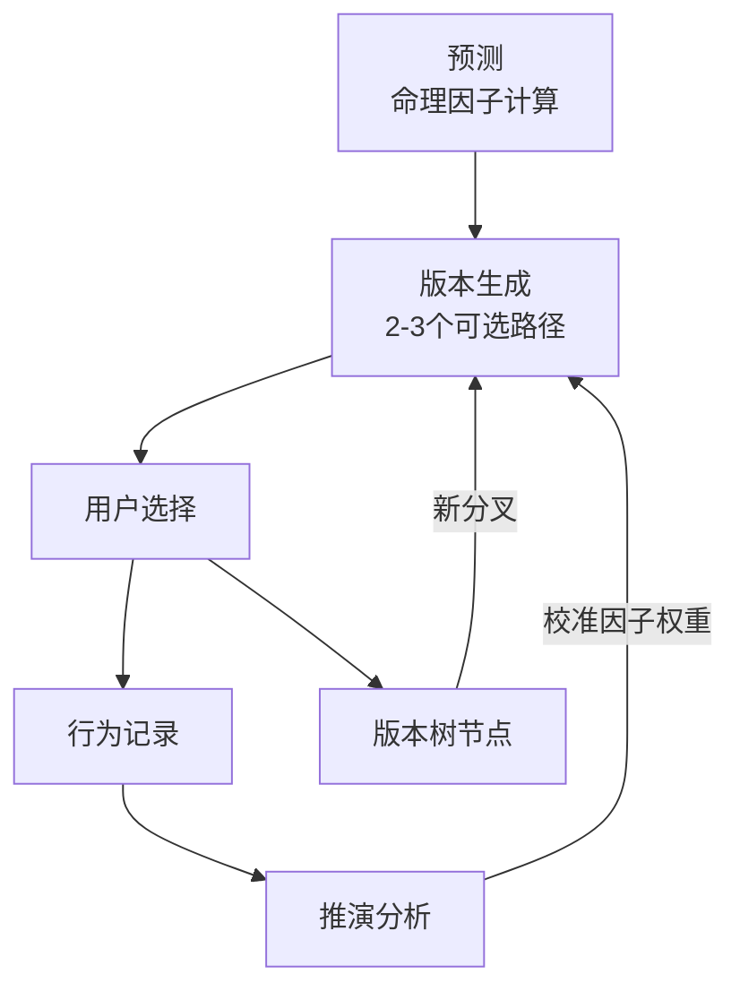

# 核心概念

> 预测、推演、版本树的定义与关系

---

## 三个核心动作

### 1. 预测（Prediction）

**定义**：基于命理因子推算的初始可能性分布。

**来源**：
- 八字：格局、十神、五行强弱
- 占星：行星落座、相位、宫位

**特点**：
- 基于出生信息计算，不随时间改变（本命因子）
- 给出"可能性范围"，不是确定结论
- 是版本生成的"种子"

**举例**：
> "您的八字偏财格 + 占星木星合金星，显示您在财富领域有较强的潜力和直觉。"

---

### 2. 推演（Inference）

**定义**：基于用户真实行为反馈，对预测进行验证和解释。

**来源**：
- 用户记录的 TO-DO/DONE
- 梦境日记
- 重大事件标注

**特点**：
- 不改变本命因子，而是解释"为什么结果如此"
- 寻找哪些因素在起作用（增强/抵消）
- 持续积累，越用越精准

**举例**：
> "您记录的投资亏损可能受以下因素影响：比劫旺相（合伙风险）+ 流年七杀（冲击年）。偏财天赋仍在，但被这两个因素抵消了。"

---

### 3. 版本树（Version Tree）

**定义**：用户人生可能性的可视化呈现，每个节点代表一种路径选择。

**结构**：
```
            [起点：注册时的初始状态]
                     |
         ┌──────────┼──────────┐
         ↓          ↓          ↓
    [稳健版]    [平衡版]    [进取版]
         |          |          |
    用户选择 ────→ [进取版]
                     |
              ┌──────┴──────┐
              ↓             ↓
         [深耕路线]    [跨界路线]
              |
         用户选择 ────→ ...
```

**特点**：
- 每个版本有多个子路径
- 用户的每次选择被记录
- 可以回看历史分叉点
- 每个节点都有因子支撑和风险提示

---

## 三者的关系



**循环逻辑**：
1. 预测提供初始种子
2. 版本生成呈现可能性
3. 用户选择记录到版本树
4. 行为反馈触发推演
5. 推演结果影响下次版本生成

---

## 与传统命理的对比

| 维度 | 传统命理 | LV |
|------|---------|-----|
| 输出形式 | 报告/解读 | 版本选项 |
| 用户角色 | 被动接受 | 主动选择 |
| 时间维度 | 静态预测 | 动态演化 |
| 反馈机制 | 无 | 持续校准 |
| 核心价值 | 告诉你会怎样 | 帮你理解为什么 |
