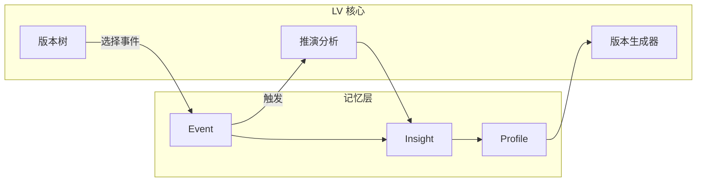

# 记忆层架构

> 让 LS 记住用户、理解用户

---

## 设计目标

记忆层是 LV 的"隐藏主线"——让系统越用越懂用户。

即使 Playbook、Dream Journal 暂时不在 MVP 中，记忆层的架构也要完整保留，为后续功能扩展预留接口。

---

## 三层记忆模型

```
┌──────────────────────────────────────────────┐
│                  Profile 层                   │
│         长期稳定特征（命理因子 + 偏好）          │
└──────────────────────────────────────────────┘
                      ↑ 聚合
┌──────────────────────────────────────────────┐
│                  Insight 层                   │
│           结构化洞察（从事件中提取）             │
└──────────────────────────────────────────────┘
                      ↑ 提取
┌──────────────────────────────────────────────┐
│                  Event 层                     │
│           原始事件记录（用户行为、梦境）          │
└──────────────────────────────────────────────┘
```

---

### Event 层：原始事件

**职责**：存储用户的每一次交互，不做任何推断。

**数据类型**：

| 事件类型 | 来源 | 示例 |
|----------|------|------|
| `todo_done` | TO-DO/DONE 记录 | "完成了 A 公司面试" |
| `dream_record` | 梦境日记 | "梦到飞在天空中" |
| `version_select` | 版本选择 | "选择了进取版职业路径" |
| `behavior_tag` | 用户主动标注 | "标记为重大事件" |

**存储字段**：

```python
class Event:
    event_id: str
    user_id: str
    kind: str           # 事件类型
    payload: dict       # 事件内容（加密存储）
    created_at: datetime
    privacy: PrivacyLevel  # PUBLIC / PRIVATE / SENSITIVE
```

**隐私处理**：
- `todo_done` 和 `dream_record` 默认为 SENSITIVE，AES-256 加密
- `version_select` 为 PRIVATE

---

### Insight 层：结构化洞察

**职责**：从 Event 中提取有意义的模式和洞察。

**生成方式**：
- 定时任务（每日 22:00）批量处理
- 或特定事件触发

**数据类型**：

| 洞察类型 | 示例 |
|----------|------|
| 行为模式 | "用户近期频繁记录加班" |
| 情绪趋势 | "梦境情绪偏负面，持续两周" |
| 决策偏好 | "用户倾向选择稳健型路径" |
| 因子验证 | "偏财相关事件结果偏负，疑似比劫影响" |

**存储字段**：

```python
class Insight:
    insight_id: str
    user_id: str
    dimension: str      # behavior / dream / decision / destiny
    summary: str        # 洞察摘要
    source_events: List[str]  # 来源事件 ID
    confidence: float   # 置信度 0-1
    time_scope: str     # recent / medium_term / long_term
    created_at: datetime
```

---

### Profile 层：用户画像

**职责**：存储长期稳定的用户特征。

**数据来源**：
1. 命理计算（初始化时）
2. Insight 层聚合
3. 用户显式偏好设置

**存储字段**：

```python
class UserProfile:
    user_id: str
    
    # 命理因子（初始化时设定，不修改）
    bazi_factors: BaZiFactors
    astro_factors: AstrologyFactors
    
    # 动态特征（从 Insight 聚合）
    traits: Dict[str, float]  # 如 {"risk_tolerance": 0.3, "career_focus": 0.8}
    
    # 因子校准记录（不修改本命因子，只记录验证情况）
    factor_validations: Dict[str, FactorValidation]
    
    # 用户偏好
    preferences: Dict[str, Any]
    
    updated_at: datetime
```

---

## 数据流

### 1. 用户输入 → Event

```
用户操作：记录 "投资 A 项目亏损 30%"
    ↓
系统行为：
  - 创建 Event(kind="todo_done", payload={text: "投资A项目亏损30%"})
  - 加密存储
  - 返回确认
```

### 2. Event → Insight（批处理）

```
定时任务：每日 22:00
    ↓
获取当日所有 Event
    ↓
LLM 结构化提取：
  - 识别领域：财富
  - 识别结果：负面
  - 识别关键词：投资、亏损
    ↓
生成 Insight：
  "财富领域出现负面结果，可能需要分析命理因子"
```

### 3. Insight → Profile（周期聚合）

```
周期性任务：每周
    ↓
聚合近期 Insight
    ↓
更新 Profile:
  - traits["investment_outcome"] = 0.3（近期偏负）
  - factor_validations["偏财格"].recent_results.append(negative)
```

### 4. Profile 影响版本生成

```
版本生成请求
    ↓
读取 Profile:
  - 偏财格存在（本命因子）
  - 但近期投资结果偏负
  - 比劫影响存疑
    ↓
版本生成考虑：
  - 进取版仍然可选（偏财天赋在）
  - 但增加风险提示（比劫 + 流年影响）
```

---

## 与 LV 其他模块的关系



---

## MVP 实现要点

1. **三层都保留**，但 Insight 生成逻辑可简化
2. **加密必须实现**，敏感数据保护是底线
3. **Profile 初始化**需要命理计算完成后立即写入
4. **预留扩展接口**，Dream Journal 加回时只需增加 Event 类型
