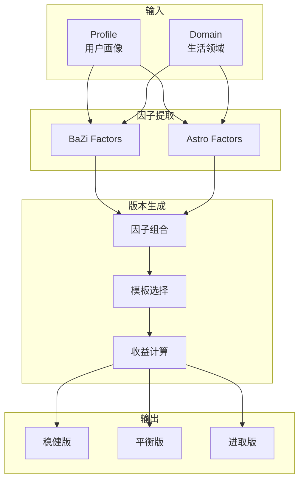

# 版本生成逻辑

> 如何从命理因子生成人生版本选项

---

## 生成流程



---

## 核心逻辑

### 1. 领域因子映射

每个生活领域有对应的命理因子：

```python
DOMAIN_FACTORS = {
    "career": {
        "bazi": ["官星", "印星", "食伤"],
        "astro": ["10宫", "土星", "太阳相位"]
    },
    "wealth": {
        "bazi": ["财星", "食伤生财", "比劫"],
        "astro": ["2宫", "木星", "金星相位"]
    },
    "relationship": {
        "bazi": ["财星(男)/官星(女)", "桃花星"],
        "astro": ["7宫", "金星", "月亮相位"]
    },
    "health": {
        "bazi": ["日主强弱", "忌神"],
        "astro": ["6宫", "火星", "困难相位"]
    }
}
```

### 2. 版本模板

三种基础版本模板：

| 模板 | 偏向因子 | 规避因子 | 风格 |
|------|---------|---------|------|
| **稳健版** | 正财、印星、土星正相位 | 偏财、七杀、火星刑冲 | 保守、长期积累 |
| **平衡版** | 无明显偏向 | 无明显规避 | 折中、灵活调整 |
| **进取版** | 偏财、食伤、木星正相位 | 比劫、枭印、土星困难相位 | 冒险、快速增长 |

### 3. 因子得分计算

```python
def calculate_version_score(factors: DomainFactors, template: Template) -> float:
    score = 0.0
    
    # 加分：偏向因子强
    for factor_id in template.bias_toward:
        if factor_id in factors:
            score += factors[factor_id].strength * 0.3
    
    # 减分：规避因子强
    for factor_id in template.bias_away:
        if factor_id in factors:
            score -= factors[factor_id].strength * 0.2
    
    # 动态调整：流年影响
    score += calculate_transit_impact(factors, template)
    
    return max(0.0, min(1.0, score))
```

### 4. 差异化保证

生成的版本必须有足够差异：

```python
MIN_DIFFERENTIATION = 0.2

def ensure_differentiation(versions: List[LifeVersion]) -> List[LifeVersion]:
    """确保版本间差异度 >= 20%"""
    for i, v1 in enumerate(versions):
        for v2 in versions[i+1:]:
            diff = calculate_differentiation(v1, v2)
            if diff < MIN_DIFFERENTIATION:
                # 调整某个版本的权重，拉开差距
                adjust_version_weights(v1, v2)
    return versions
```

---

## 版本内容结构

每个版本包含：

```python
class LifeVersion:
    version_id: str
    title: str              # "稳健版"
    subtitle: str           # "细水长流的财富积累"
    
    # 策略
    strategy: List[str]     # ["长期持有优质资产", "控制杠杆比例"]
    key_actions: List[str]  # ["建立定投计划", "配置保险"]
    
    # 预期收益
    expected_outcomes: Dict[str, float]  # {"income_ceiling": 0.6, "stability": 0.9}
    
    # 风险提示
    risks: List[str]        # ["收益增长较慢", "可能错过高回报机会"]
    
    # 因子支撑
    source_factors: List[str]  # ["正财格", "土星拱太阳"]
    
    # 适合人群
    suitable_for: List[str]    # ["追求稳定的人", "有家庭责任的人"]
    not_suitable_for: List[str] # ["高风险承受能力者"]
```

---

## 双体系融合策略

### 一致性处理

当八字和占星给出相似信号：

```
八字：正财格，适合稳定收入
占星：土星拱木星，长期积累

→ 强化"稳健版"的推荐权重
→ 增加置信度
```

### 冲突处理

当两体系信号矛盾：

```
八字：偏财格，有投机潜力
占星：土星刑木星，财务收缩

→ 不取平均
→ 生成一个"分歧版"，展示两种可能
→ 引导用户通过行为反馈来校准
```

```python
def handle_system_conflict(bazi_signal: str, astro_signal: str) -> List[LifeVersion]:
    if signals_conflict(bazi_signal, astro_signal):
        return [
            generate_bazi_aligned_version(bazi_signal),
            generate_astro_aligned_version(astro_signal),
            generate_balanced_version()
        ]
    else:
        return generate_unified_versions()
```

---

## 动态因子影响

### 流年调整

```python
def apply_transit_impact(base_versions: List[LifeVersion], transits: TransitFactors):
    for version in base_versions:
        # 流年七杀冲击 → 进取版风险提升
        if "七杀" in transits.yearly_factors:
            if version.title == "进取版":
                version.risks.append("今年流年七杀，激进决策风险较高")
                version.expected_outcomes["stability"] *= 0.8
        
        # 流年正财 → 稳健版收益微增
        if "正财" in transits.yearly_factors:
            if version.title == "稳健版":
                version.expected_outcomes["income_stability"] *= 1.1
```

---

## 与记忆层的联动

版本生成时读取 Profile：

```python
def generate_versions(user_id: str, domain: str) -> LifeVersionSet:
    # 读取用户画像
    profile = memory_service.get_profile(user_id)
    
    # 提取命理因子
    bazi = profile.bazi_factors
    astro = profile.astro_factors
    
    # 读取历史验证记录
    validations = profile.factor_validations
    
    # 调整因子权重（基于历史反馈，但不改变本命因子）
    adjusted_factors = apply_validation_adjustments(bazi, astro, validations)
    
    # 生成版本
    versions = generator.generate(adjusted_factors, domain)
    
    return versions
```

---

## 版本对比矩阵

生成对比视图供用户参考：

| 维度 | 稳健版 | 平衡版 | 进取版 |
|------|--------|--------|--------|
| 收入上限 | ⭐⭐ | ⭐⭐⭐ | ⭐⭐⭐⭐⭐ |
| 稳定性 | ⭐⭐⭐⭐⭐ | ⭐⭐⭐ | ⭐⭐ |
| 成长性 | ⭐⭐ | ⭐⭐⭐ | ⭐⭐⭐⭐ |
| 风险 | 低 | 中 | 高 |
| 适合周期 | 长期（5-10年） | 中期（2-5年） | 短期（1-2年） |
