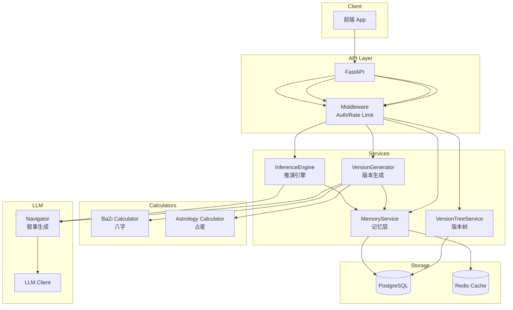

# 技术架构

> LV MVP 系统设计

---

## 系统架构图



---

## 模块职责

### API Layer

| 路由 | 方法 | 功能 |
|------|------|------|
| `/auth/register` | POST | 用户注册 |
| `/profile/init` | POST | 初始化命理画像 |
| `/versions/generate` | POST | 生成版本集 |
| `/versions/{set_id}` | GET | 获取版本集 |
| `/versions/{set_id}/select` | POST | 选择版本 |
| `/tree/{tree_id}` | GET | 获取版本树 |
| `/memory/events` | POST | 记录事件 |
| `/memory/profile` | GET | 获取画像 |
| `/inference/analyze` | POST | 推演分析 |

### Services Layer

```python
# 版本生成服务
class VersionGenerator:
    def generate(domain: str, factors: DomainFactors) -> LifeVersionSet
    def compare(version_set: LifeVersionSet) -> VersionComparison

# 版本树服务
class VersionTreeService:
    def create_tree(user_id: str, version_set: LifeVersionSet) -> VersionTree
    def record_decision(tree_id: str, node_id: str, option: str) -> DecisionRecord
    def get_current_path(tree_id: str) -> TreeTraversalPath

# 记忆服务
class MemoryService:
    def record_event(user_id: str, event: Event) -> str
    def get_profile(user_id: str) -> UserProfile
    def update_profile(user_id: str, updates: Dict) -> None

# 推演引擎
class InferenceEngine:
    def analyze(user_id: str, event_id: str) -> InferenceResult
```

### Calculators

```python
# 八字计算器
class BaZiCalculator:
    def calculate(birth_info: BirthInfo) -> BaZiFactors
    def get_dayun(bazi: BaZiFactors, current_date: date) -> DayunInfo
    def get_yearly(bazi: BaZiFactors, year: int) -> YearlyInfo

# 占星计算器
class AstrologyCalculator:
    def calculate(birth_info: BirthInfo) -> AstrologyFactors
    def get_transits(natal: AstrologyFactors, current_date: date) -> TransitFactors
```

---

## 数据流

### 用户注册与初始化

```
1. POST /auth/register → 创建用户
2. POST /profile/init
   - 输入: birth_date, birth_time, birth_place, gender
   - 调用 BaZiCalculator.calculate()
   - 调用 AstrologyCalculator.calculate()
   - 存储到 user_destiny_profiles
   - 创建初始 Profile
```

### 版本生成

```
1. POST /versions/generate
   - 读取 Profile
   - 提取领域因子
   - VersionGenerator.generate()
   - LLM 生成版本叙事
   - 返回 LifeVersionSet
```

### 版本选择

```
1. POST /versions/{set_id}/select
   - 验证版本存在
   - 记录到 Memory.Event
   - 更新版本树节点
   - 返回新的树状态
```

### 推演分析

```
1. POST /memory/events → 记录行为
2. POST /inference/analyze
   - 读取相关事件
   - 提取关联因子
   - 分析因子交互
   - LLM 生成推演叙事
   - 存储 Insight
```

---

## 技术选型

### 后端

| 组件 | 选型 | 说明 |
|------|------|------|
| 框架 | FastAPI | 高性能异步 API |
| ORM | SQLAlchemy | 数据库抽象 |
| 验证 | Pydantic | 数据模型 |
| 任务队列 | Celery（可选） | 批处理任务 |

### 数据存储

| 组件 | 选型 | 用途 |
|------|------|------|
| 主数据库 | PostgreSQL | 用户、版本树、事件 |
| 缓存 | Redis | 会话、因子缓存 |

### LLM

| 组件 | 选型 | 说明 |
|------|------|------|
| Provider | OpenAI / Claude / DeepSeek | 可配置 |
| 调用方式 | 直接 API | MVP 简化版 |

### 命理计算

| 组件 | 来源 | 说明 |
|------|------|------|
| 八字 | LS 现有 | `backend/calculators/bazi/` |
| 占星 | Swiss Ephemeris | 或现有实现 |
| 农历 | lunar-python | 日期转换 |

---

## 部署架构

### MVP 阶段（单机）

```
┌─────────────────────────────────────┐
│           Docker Compose            │
├─────────────────────────────────────┤
│  ┌─────────┐  ┌─────────┐          │
│  │   API   │  │  Worker │          │
│  │ (8000)  │  │ (Celery)│          │
│  └─────────┘  └─────────┘          │
│        ↓           ↓                │
│  ┌─────────────────────────────────┐│
│  │         PostgreSQL              ││
│  └─────────────────────────────────┘│
│  ┌─────────────────────────────────┐│
│  │            Redis                ││
│  └─────────────────────────────────┘│
└─────────────────────────────────────┘
```

### 后续扩展

- API 水平扩展
- 数据库读写分离
- CDN 静态资源

---

## 目录结构

```
lv_mvp/
├── api/
│   ├── __init__.py
│   ├── main.py
│   ├── deps.py              # 依赖注入
│   └── routes/
│       ├── auth.py
│       ├── profile.py
│       ├── versions.py
│       ├── tree.py
│       ├── memory.py
│       └── inference.py
├── models/
│   ├── life_version.py
│   ├── version_tree.py
│   ├── memory.py
│   └── user.py
├── services/
│   ├── version_generator.py
│   ├── version_tree.py
│   ├── memory.py
│   └── inference.py
├── calculators/
│   ├── bazi/
│   │   └── (复用 LS 代码)
│   └── astrology/
│       └── calculator.py
├── llm/
│   ├── client.py
│   └── navigator.py
├── db/
│   ├── session.py
│   └── models.py
├── core/
│   ├── config.py
│   └── security.py
├── tests/
└── docker-compose.yml
```

---

## 安全设计

### 认证

- JWT Token
- Token 过期：24 小时
- Refresh Token 机制

### 数据保护

- 敏感字段 AES-256-GCM 加密
- 数据库连接 TLS
- API HTTPS only

### 访问控制

- 用户只能访问自己的数据
- 管理员无法查看明文敏感数据
