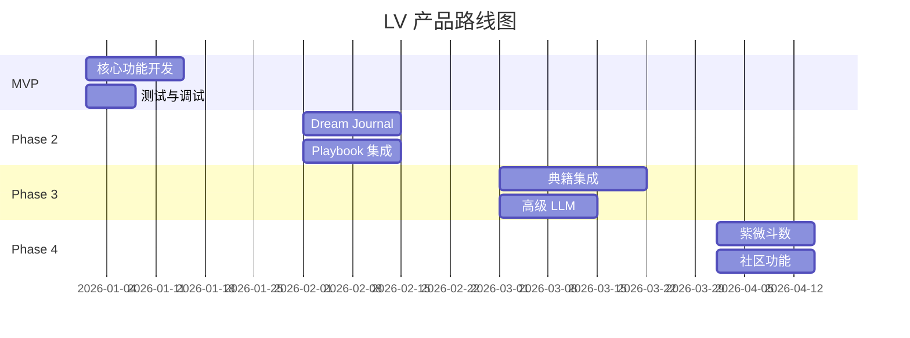

# 后续路线图

> MVP 之后的扩展计划

---

## 版本规划

---

## Phase 2: 功能扩展

### Dream Journal 回归

**目标**：将梦境作为校准数据源

**实现**：
- 新增 Event 类型：`dream_record`
- 梦境解析服务（LLM）
- 梦境与版本因子关联分析

**价值**：
- 增加用户粘性（日常记录）
- 丰富推演数据源

### Playbook 集成

**目标**：基于版本生成个性化解读报告

**实现**：
- 版本 → Playbook 生成器
- 多时间粒度（年/月/周）
- LLM 叙事丰富化

**价值**：
- 增加内容深度
- 提供可分享的输出物

---

## Phase 3: 内容增强

### 典籍集成

**目标**：LLM 叙事引用典籍原文

**实现**：
- 典籍语义索引
- TOON 序列化器
- Prompt 注入典籍片段

**价值**：
- 增加权威性
- 差异化竞争优势

### 高级 LLM 能力

**目标**：更智能的叙事生成

**实现**：
- 多模型路由（成本优化）
- 上下文记忆（对话连续性）
- 个性化语气调优

---

## Phase 4: 体系扩展

### 紫微斗数

**目标**：增加第三命理体系

**实现**：
- 紫微计算器
- 因子融合逻辑扩展
- 三体系协同

### 社区功能（谨慎）

**目标**：匿名案例分享

**实现**：
- 脱敏版本路径分享
- 社区讨论（不暴露个人信息）

**风险控制**：
- 严格脱敏
- 用户主动选择分享

---

## 商业化路径

### MVP 阶段

- 免费体验：仅查看本命因子
- Plus 订阅：完整版本功能

### Phase 2+

- 高级功能分层收费
- Playbook 单次购买
- 年度会员折扣

---

## 技术债务管理

| 阶段 | 预期债务 | 处理方式 |
|------|---------|---------|
| MVP | 简化 LLM Prompt | Phase 3 升级 |
| MVP | 内存存储部分数据 | Phase 2 全量持久化 |
| Phase 2 | 批处理任务堆积 | Phase 3 队列优化 |

---

## 里程碑

| 里程碑 | 时间 | 标志 |
|--------|------|------|
| MVP Alpha | +2 周 | 核心流程可运行 |
| MVP Beta | +4 周 | 内部测试通过 |
| MVP Launch | +6 周 | 首批用户上线 |
| Phase 2 | +10 周 | Dream + Playbook |
| Phase 3 | +16 周 | 典籍集成 |
